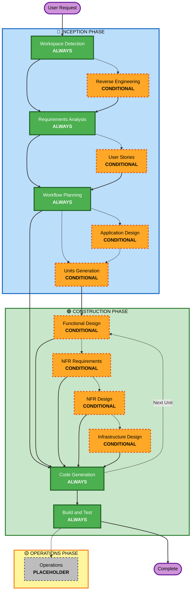

# AI-DLC Adaptive Workflow Overview

Technical reference with workflow diagram. See core-workflow.md for user-facing details.

- **INCEPTION**: Planning and architecture (Workspace Detection, Requirements Analysis, Workflow Planning + conditional stages)
- **CONSTRUCTION**: Design, build, test (per-unit design + Code Generation + Build & Test)
- **OPERATIONS**: Placeholder for future deployment/monitoring

Green = always executes. Orange dashed = conditional. Grey dashed = placeholder.
