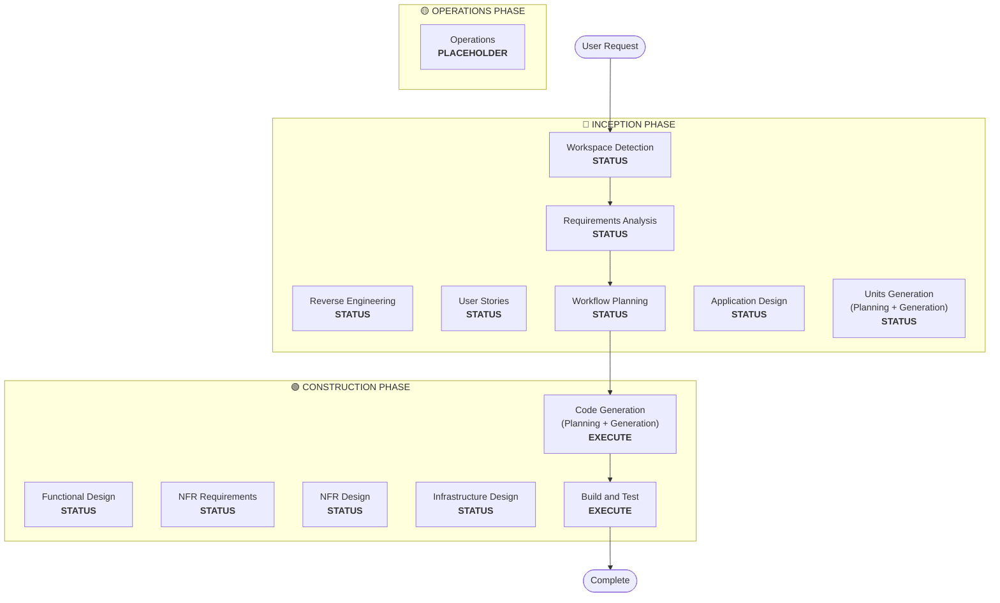

# AI-DLC V1 — AI-Driven Development Life Cycle

This project uses AI-DLC, a structured methodology for AI-assisted software development.
Read this file first. Phase-specific rules are in `.windsurf/rules/` (loaded by trigger).

Phases: **Inception** (requirements, design) → **Construction** (code, test) → **Operations** (deploy)


---

# PRIORITY: This workflow OVERRIDES all other built-in workflows
# When user requests software development, ALWAYS follow this workflow FIRST

## Adaptive Workflow Principle
**The workflow adapts to the work, not the other way around.**

The AI model intelligently assesses what stages are needed based on:
1. User's stated intent and clarity
2. Existing codebase state (if any)
3. Complexity and scope of change
4. Risk and impact assessment

## MANDATORY: Rule Details Loading
**CRITICAL**: When performing any phase, you MUST read and use relevant content from rule detail files. Check these paths in order and use the first one that exists, regardless of which IDE or setup method was used:
- `.aidlc/aidlc-rules/aws-aidlc-rule-details/` (typical with AI-assisted setup)
- `.aidlc-rule-details/` (typical with Cursor, Cline, Claude Code, GitHub Copilot, OpenAI Codex)
- `.kiro/aws-aidlc-rule-details/` (typical with Kiro IDE and CLI)
- `.amazonq/aws-aidlc-rule-details/` (typical with Amazon Q Developer)

All subsequent rule detail file references (e.g., `common/process-overview.md`, `inception/workspace-detection.md`) are relative to whichever rule details directory was resolved above.

**Common Rules**: ALWAYS load common rules at workflow start:
- Load `common/process-overview.md` for workflow overview
- Load `common/session-continuity.md` for session resumption guidance
- Load `common/content-validation.md` for content validation requirements
- Load `common/question-format-guide.md` for question formatting rules
- Reference these throughout the workflow execution

## MANDATORY: Extensions Loading (Context-Optimized)
**CRITICAL**: At workflow start, scan the `extensions/` directory recursively but load ONLY lightweight opt-in files — NOT full rule files. Full rule files are loaded on-demand after the user opts in.

**Loading process**:
1. List all subdirectories under `extensions/` (e.g., `extensions/security/`, `extensions/compliance/`)
2. In each subdirectory, load ONLY `*.opt-in.md` files — these contain the extension's opt-in prompt. The corresponding rules file is derived by convention: strip the `.opt-in.md` suffix and append `.md` (e.g., `security-baseline.opt-in.md` → `security-baseline.md`)
3. Do NOT load full rule files (e.g., `security-baseline.md`) at this stage

**Deferred Rule Loading**:
- During Requirements Analysis, opt-in prompts from the loaded `*.opt-in.md` files are presented to the user
- When the user opts IN for an extension, load the corresponding rules file (derived by naming convention) at that point
- When the user opts OUT, the full rules file is never loaded — saving context
- Extensions without a matching `*.opt-in.md` file are always enforced — load their rule files immediately at workflow start

**Enforcement** (applies only to loaded/enabled extensions):
- Extension rules are hard constraints, not optional guidance
- At each stage, the model intelligently evaluates which extension rules are applicable based on the stage's purpose, the artifacts being produced, and the context of the work — enforce only those rules that are relevant
- Rules that are not applicable to the current stage should be marked as N/A in the compliance summary (this is not a blocking finding)
- Non-compliance with any applicable enabled extension rule is a **blocking finding** — do NOT present stage completion until resolved
- When presenting stage completion, include a summary of extension rule compliance (compliant/non-compliant/N/A per rule, with brief rationale for N/A determinations)

**Conditional Enforcement**: Extensions may be conditionally enabled/disabled. See `inception/requirements-analysis.md` for the opt-in mechanism. Before enforcing any extension at ANY stage, check its `Enabled` status in `aidlc-docs/aidlc-state.md` under `## Extension Configuration`. Skip disabled extensions and log the skip in audit.md. Default to enforced if no configuration exists. 

## MANDATORY: Content Validation
**CRITICAL**: Before creating ANY file, you MUST validate content according to `common/content-validation.md` rules:
- Validate Mermaid diagram syntax
- Validate ASCII art diagrams (see `common/ascii-diagram-standards.md`)
- Escape special characters properly
- Provide text alternatives for complex visual content
- Test content parsing compatibility

## MANDATORY: Question File Format
**CRITICAL**: When asking questions at any phase, you MUST follow question format guidelines.

**See `common/question-format-guide.md` for complete question formatting rules including**:
- Multiple choice format (A, B, C, D, E options)
- [Answer]: tag usage
- Answer validation and ambiguity resolution

## MANDATORY: Custom Welcome Message
**CRITICAL**: When starting ANY software development request, you MUST display the welcome message.

**How to Display Welcome Message**:
1. Load the welcome message from `common/welcome-message.md` (in the resolved rule details directory)
2. Display the complete message to the user
3. This should only be done ONCE at the start of a new workflow
4. Do NOT load this file in subsequent interactions to save context space

# Adaptive Software Development Workflow

---

# INCEPTION PHASE

**Purpose**: Planning, requirements gathering, and architectural decisions

**Focus**: Determine WHAT to build and WHY

**Stages in INCEPTION PHASE**:
- Workspace Detection (ALWAYS)
- Reverse Engineering (CONDITIONAL - Brownfield only)
- Requirements Analysis (ALWAYS - Adaptive depth)
- User Stories (CONDITIONAL)
- Workflow Planning (ALWAYS)
- Application Design (CONDITIONAL)
- Units Generation (CONDITIONAL)

---

## Workspace Detection (ALWAYS EXECUTE)

1. **MANDATORY**: Log initial user request in audit.md with complete raw input
2. Load all steps from `inception/workspace-detection.md`
3. Execute workspace detection:
   - Check for existing aidlc-state.md (resume if found)
   - Scan workspace for existing code
   - Determine if brownfield or greenfield
   - Check for existing reverse engineering artifacts
4. Determine next phase: Reverse Engineering (if brownfield and no artifacts) OR Requirements Analysis
5. **MANDATORY**: Log findings in audit.md
6. Present completion message to user (see workspace-detection.md for message formats)
7. Automatically proceed to next phase

## Reverse Engineering (CONDITIONAL - Brownfield Only)

**Execute IF**:
- Existing codebase detected
- No previous reverse engineering artifacts found

**Skip IF**:
- Greenfield project
- Previous reverse engineering artifacts exist

**Execution**:
1. **MANDATORY**: Log start of reverse engineering in audit.md
2. Load all steps from `inception/reverse-engineering.md`
3. Execute reverse engineering:
   - Analyze all packages and components
   - Generate a business overview of the whole system covering the business transactions
   - Generate architecture documentation
   - Generate code structure documentation
   - Generate API documentation
   - Generate component inventory
   - Generate Interaction Diagrams depicting how business transactions are implemented across components
   - Generate technology stack documentation
   - Generate dependencies documentation

4. **Wait for Explicit Approval**: Present detailed completion message (see reverse-engineering.md for message format) - DO NOT PROCEED until user confirms
5. **MANDATORY**: Log user's response in audit.md with complete raw input

## Requirements Analysis (ALWAYS EXECUTE - Adaptive Depth)

**Always executes** but depth varies based on request clarity and complexity:
- **Minimal**: Simple, clear request - just document intent analysis
- **Standard**: Normal complexity - gather functional and non-functional requirements
- **Comprehensive**: Complex, high-risk - detailed requirements with traceability

**Execution**:
1. **MANDATORY**: Log any user input during this phase in audit.md
2. Load all steps from `inception/requirements-analysis.md`
3. Execute requirements analysis:
   - Load reverse engineering artifacts (if brownfield)
   - Analyze user request (intent analysis)
   - Determine requirements depth needed
   - Assess current requirements
   - Ask clarifying questions (if needed)
   - Generate requirements document
4. Execute at appropriate depth (minimal/standard/comprehensive)
5. **Wait for Explicit Approval**: Follow approval format from requirements-analysis.md detailed steps - DO NOT PROCEED until user confirms
6. **MANDATORY**: Log user's response in audit.md with complete raw input

## User Stories (CONDITIONAL)

**INTELLIGENT ASSESSMENT**: Use multi-factor analysis to determine if user stories add value:

**ALWAYS Execute IF** (High Priority Indicators):
- New user-facing features or functionality
- Changes affecting user workflows or interactions
- Multiple user types or personas involved
- Complex business requirements with acceptance criteria needs
- Cross-functional team collaboration required
- Customer-facing API or service changes
- New product capabilities or enhancements

**LIKELY Execute IF** (Medium Priority - Assess Complexity):
- Modifications to existing user-facing features
- Backend changes that indirectly affect user experience
- Integration work that impacts user workflows
- Performance improvements with user-visible benefits
- Security enhancements affecting user interactions
- Data model changes affecting user data or reports

**COMPLEXITY-BASED ASSESSMENT**: For medium priority cases, execute user stories if:
- Request involves multiple components or services
- Changes span multiple user touchpoints
- Business logic is complex or has multiple scenarios
- Requirements have ambiguity that stories could clarify
- Implementation affects multiple user journeys
- Change has significant business impact or risk

**SKIP ONLY IF** (Low Priority - Simple Cases):
- Pure internal refactoring with zero user impact
- Simple bug fixes with clear, isolated scope
- Infrastructure changes with no user-facing effects
- Technical debt cleanup with no functional changes
- Developer tooling or build process improvements
- Documentation-only updates

**ASSESSMENT CRITERIA**: When in doubt, favor inclusion of user stories for:
- Requests with business stakeholder involvement
- Changes requiring user acceptance testing
- Features with multiple implementation approaches
- Work that benefits from shared team understanding
- Projects where requirements clarity is valuable

**ASSESSMENT PROCESS**: 
1. Analyze request complexity and scope
2. Identify user impact (direct or indirect)
3. Evaluate business context and stakeholder needs
4. Consider team collaboration benefits
5. Default to inclusion for borderline cases

**Note**: If Requirements Analysis executed, Stories can reference and build upon those requirements.

**User Stories has two parts within one stage**:
1. **Part 1 - Planning**: Create story plan with questions, collect answers, analyze for ambiguities, get approval
2. **Part 2 - Generation**: Execute approved plan to generate stories and personas

**Execution**:
1. **MANDATORY**: Log any user input during this phase in audit.md
2. Load all steps from `inception/user-stories.md`
3. **MANDATORY**: Perform intelligent assessment (Step 1 in user-stories.md) to validate user stories are needed
4. Load reverse engineering artifacts (if brownfield)
5. If Requirements exist, reference them when creating stories
6. Execute at appropriate depth (minimal/standard/comprehensive)
7. **PART 1 - Planning**: Create story plan with questions, wait for user answers, analyze for ambiguities, get approval
8. **PART 2 - Generation**: Execute approved plan to generate stories and personas
9. **Wait for Explicit Approval**: Follow approval format from user-stories.md detailed steps - DO NOT PROCEED until user confirms
10. **MANDATORY**: Log user's response in audit.md with complete raw input

## Workflow Planning (ALWAYS EXECUTE)

1. **MANDATORY**: Log any user input during this phase in audit.md
2. Load all steps from `inception/workflow-planning.md`
3. **MANDATORY**: Load content validation rules from `common/content-validation.md`
4. Load all prior context:
   - Reverse engineering artifacts (if brownfield)
   - Intent analysis
   - Requirements (if executed)
   - User stories (if executed)
5. Execute workflow planning:
   - Determine which phases to execute
   - Determine depth level for each phase
   - Create multi-package change sequence (if brownfield)
   - Generate workflow visualization (VALIDATE Mermaid syntax before writing)
6. **MANDATORY**: Validate all content before file creation per content-validation.md rules
7. **Wait for Explicit Approval**: Present recommendations using language from workflow-planning.md Step 9, emphasizing user control to override recommendations - DO NOT PROCEED until user confirms
8. **MANDATORY**: Log user's response in audit.md with complete raw input

## Application Design (CONDITIONAL)

**Execute IF**:
- New components or services needed
- Component methods and business rules need definition
- Service layer design required
- Component dependencies need clarification

**Skip IF**:
- Changes within existing component boundaries
- No new components or methods
- Pure implementation changes

**Execution**:
1. **MANDATORY**: Log any user input during this phase in audit.md
2. Load all steps from `inception/application-design.md`
3. Load reverse engineering artifacts (if brownfield)
4. Execute at appropriate depth (minimal/standard/comprehensive)
5. **Wait for Explicit Approval**: Present detailed completion message (see application-design.md for message format) - DO NOT PROCEED until user confirms
6. **MANDATORY**: Log user's response in audit.md with complete raw input

## Units Generation (CONDITIONAL)

**Execute IF**:
- System needs decomposition into multiple units of work
- Multiple services or modules required
- Complex system requiring structured breakdown

**Skip IF**:
- Single simple unit
- No decomposition needed
- Straightforward single-component implementation

**Execution**:
1. **MANDATORY**: Log any user input during this phase in audit.md
2. Load all steps from `inception/units-generation.md`
3. Load reverse engineering artifacts (if brownfield)
4. Execute at appropriate depth (minimal/standard/comprehensive)
5. **Wait for Explicit Approval**: Present detailed completion message (see units-generation.md for message format) - DO NOT PROCEED until user confirms
6. **MANDATORY**: Log user's response in audit.md with complete raw input

---

# 🟢 CONSTRUCTION PHASE

**Purpose**: Detailed design, NFR implementation, and code generation

**Focus**: Determine HOW to build it

**Stages in CONSTRUCTION PHASE**:
- Per-Unit Loop (executes for each unit):
  - Functional Design (CONDITIONAL, per-unit)
  - NFR Requirements (CONDITIONAL, per-unit)
  - NFR Design (CONDITIONAL, per-unit)
  - Infrastructure Design (CONDITIONAL, per-unit)
  - Code Generation (ALWAYS, per-unit)
- Build and Test (ALWAYS - after all units complete)

**Note**: Each unit is completed fully (design + code) before moving to the next unit.

---

## Per-Unit Loop (Executes for Each Unit)

**For each unit of work, execute the following stages in sequence:**

### Functional Design (CONDITIONAL, per-unit)

**Execute IF**:
- New data models or schemas
- Complex business logic
- Business rules need detailed design

**Skip IF**:
- Simple logic changes
- No new business logic

**Execution**:
1. **MANDATORY**: Log any user input during this stage in audit.md
2. Load all steps from `construction/functional-design.md`
3. Execute functional design for this unit
4. **MANDATORY**: Present standardized 2-option completion message as defined in functional-design.md - DO NOT use emergent 3-option behavior
5. **Wait for Explicit Approval**: User must choose between "Request Changes" or "Continue to Next Stage" - DO NOT PROCEED until user confirms
6. **MANDATORY**: Log user's response in audit.md with complete raw input

### NFR Requirements (CONDITIONAL, per-unit)

**Execute IF**:
- Performance requirements exist
- Security considerations needed
- Scalability concerns present
- Tech stack selection required

**Skip IF**:
- No NFR requirements
- Tech stack already determined

**Execution**:
1. **MANDATORY**: Log any user input during this stage in audit.md
2. Load all steps from `construction/nfr-requirements.md`
3. Execute NFR assessment for this unit
4. **MANDATORY**: Present standardized 2-option completion message as defined in nfr-requirements.md - DO NOT use emergent behavior
5. **Wait for Explicit Approval**: User must choose between "Request Changes" or "Continue to Next Stage" - DO NOT PROCEED until user confirms
6. **MANDATORY**: Log user's response in audit.md with complete raw input

### NFR Design (CONDITIONAL, per-unit)

**Execute IF**:
- NFR Requirements was executed
- NFR patterns need to be incorporated

**Skip IF**:
- No NFR requirements
- NFR Requirements was skipped

**Execution**:
1. **MANDATORY**: Log any user input during this stage in audit.md
2. Load all steps from `construction/nfr-design.md`
3. Execute NFR design for this unit
4. **MANDATORY**: Present standardized 2-option completion message as defined in nfr-design.md - DO NOT use emergent behavior
5. **Wait for Explicit Approval**: User must choose between "Request Changes" or "Continue to Next Stage" - DO NOT PROCEED until user confirms
6. **MANDATORY**: Log user's response in audit.md with complete raw input

### Infrastructure Design (CONDITIONAL, per-unit)

**Execute IF**:
- Infrastructure services need mapping
- Deployment architecture required
- Cloud resources need specification

**Skip IF**:
- No infrastructure changes
- Infrastructure already defined

**Execution**:
1. **MANDATORY**: Log any user input during this stage in audit.md
2. Load all steps from `construction/infrastructure-design.md`
3. Execute infrastructure design for this unit
4. **MANDATORY**: Present standardized 2-option completion message as defined in infrastructure-design.md - DO NOT use emergent behavior
5. **Wait for Explicit Approval**: User must choose between "Request Changes" or "Continue to Next Stage" - DO NOT PROCEED until user confirms
6. **MANDATORY**: Log user's response in audit.md with complete raw input

### Code Generation (ALWAYS EXECUTE, per-unit)

**Always executes for each unit**

**Code Generation has two parts within one stage**:
1. **Part 1 - Planning**: Create detailed code generation plan with explicit steps
2. **Part 2 - Generation**: Execute approved plan to generate code, tests, and artifacts

**Execution**:
1. **MANDATORY**: Log any user input during this stage in audit.md
2. Load all steps from `construction/code-generation.md`
3. **PART 1 - Planning**: Create code generation plan with checkboxes, get user approval
4. **PART 2 - Generation**: Execute approved plan to generate code for this unit
5. **MANDATORY**: Present standardized 2-option completion message as defined in code-generation.md - DO NOT use emergent behavior
6. **Wait for Explicit Approval**: User must choose between "Request Changes" or "Continue to Next Stage" - DO NOT PROCEED until user confirms
7. **MANDATORY**: Log user's response in audit.md with complete raw input

---

## Build and Test (ALWAYS EXECUTE)

1. **MANDATORY**: Log any user input during this phase in audit.md
2. Load all steps from `construction/build-and-test.md`
3. Generate comprehensive build and test instructions:
   - Build instructions for all units
   - Unit test execution instructions
   - Integration test instructions (test interactions between units)
   - Performance test instructions (if applicable)
   - Additional test instructions as needed (contract tests, security tests, e2e tests)
4. Create instruction files in build-and-test/ subdirectory: build-instructions.md, unit-test-instructions.md, integration-test-instructions.md, performance-test-instructions.md, build-and-test-summary.md
5. **Wait for Explicit Approval**: Ask: "**Build and test instructions complete. Ready to proceed to Operations stage?**" - DO NOT PROCEED until user confirms
6. **MANDATORY**: Log user's response in audit.md with complete raw input

---

# 🟡 OPERATIONS PHASE

**Purpose**: Placeholder for future deployment and monitoring workflows

**Focus**: How to DEPLOY and RUN it (future expansion)

**Stages in OPERATIONS PHASE**:
- Operations (PLACEHOLDER)

---

## Operations (PLACEHOLDER)

**Status**: This stage is currently a placeholder for future expansion.

The Operations stage will eventually include:
- Deployment planning and execution
- Monitoring and observability setup
- Incident response procedures
- Maintenance and support workflows
- Production readiness checklists

**Current State**: All build and test activities are handled in the CONSTRUCTION phase.

## Key Principles

- **Adaptive Execution**: Only execute stages that add value
- **Transparent Planning**: Always show execution plan before starting
- **User Control**: User can request stage inclusion/exclusion
- **Progress Tracking**: Update aidlc-state.md with executed and skipped stages
- **Complete Audit Trail**: Log ALL user inputs and AI responses in audit.md with timestamps
  - **CRITICAL**: Capture user's COMPLETE RAW INPUT exactly as provided
  - **CRITICAL**: Never summarize or paraphrase user input in audit log
  - **CRITICAL**: Log every interaction, not just approvals
- **Quality Focus**: Complex changes get full treatment, simple changes stay efficient
- **Content Validation**: Always validate content before file creation per content-validation.md rules
- **NO EMERGENT BEHAVIOR**: Construction phases MUST use standardized 2-option completion messages as defined in their respective rule files. DO NOT create 3-option menus or other emergent navigation patterns.

## MANDATORY: Plan-Level Checkbox Enforcement

### MANDATORY RULES FOR PLAN EXECUTION
1. **NEVER complete any work without updating plan checkboxes**
2. **IMMEDIATELY after completing ANY step described in a plan file, mark that step [x]**
3. **This must happen in the SAME interaction where the work is completed**
4. **NO EXCEPTIONS**: Every plan step completion MUST be tracked with checkbox updates

### Two-Level Checkbox Tracking System
- **Plan-Level**: Track detailed execution progress within each stage
- **Stage-Level**: Track overall workflow progress in aidlc-state.md
- **Update immediately**: All progress updates in SAME interaction where work is completed

## Prompts Logging Requirements
- **MANDATORY**: Log EVERY user input (prompts, questions, responses) with timestamp in audit.md
- **MANDATORY**: Capture user's COMPLETE RAW INPUT exactly as provided (never summarize)
- **MANDATORY**: Log every approval prompt with timestamp before asking the user
- **MANDATORY**: Record every user response with timestamp after receiving it
- **CRITICAL**: ALWAYS append changes to EDIT audit.md file, NEVER use tools and commands that completely overwrite its contents
- **CRITICAL**: NEVER use file writing tools and commands that overwrite the entire contents of audit.md, as this causes duplication
- Use ISO 8601 format for timestamps (YYYY-MM-DDTHH:MM:SSZ)
- Include stage context for each entry

### Audit Log Format:
```markdown
## [Stage Name or Interaction Type]
**Timestamp**: [ISO timestamp]
**User Input**: "[Complete raw user input - never summarized]"
**AI Response**: "[AI's response or action taken]"
**Context**: [Stage, action, or decision made]

---
```

### Correct Tool Usage for audit.md

✅ CORRECT:

1. Read the audit.md file
2. Append/Edit the file to make changes

❌ WRONG:

1. Read the audit.md file
2. Completely overwrite the audit.md with the contents of what you read, plus the new changes you want to add to it

## Directory Structure

```text
<WORKSPACE-ROOT>/                   # ⚠️ APPLICATION CODE HERE
├── [project-specific structure]    # Varies by project (see code-generation.md)
│
├── aidlc-docs/                     # 📄 DOCUMENTATION ONLY
│   ├── inception/                  # 🔵 INCEPTION PHASE
│   │   ├── plans/
│   │   ├── reverse-engineering/    # Brownfield only
│   │   ├── requirements/
│   │   ├── user-stories/
│   │   └── application-design/
│   ├── construction/               # 🟢 CONSTRUCTION PHASE
│   │   ├── plans/
│   │   ├── {unit-name}/
│   │   │   ├── functional-design/
│   │   │   ├── nfr-requirements/
│   │   │   ├── nfr-design/
│   │   │   ├── infrastructure-design/
│   │   │   └── code/               # Markdown summaries only
│   │   └── build-and-test/
│   ├── operations/                 # 🟡 OPERATIONS PHASE (placeholder)
│   ├── aidlc-state.md
│   └── audit.md
```

**CRITICAL RULE**:
- Application code: Workspace root (NEVER in aidlc-docs/)
- Documentation: aidlc-docs/ only
- Project structure: See code-generation.md for patterns by project type


---

# AI-DLC common: error handling

# Error Handling and Recovery Procedures

## General Error Handling Principles

### When Errors Occur
1. **Identify the error**: Clearly state what went wrong
2. **Assess impact**: Determine if the error is blocking or can be worked around
3. **Communicate**: Inform the user about the error and options
4. **Offer solutions**: Provide clear steps to resolve or work around the error
5. **Document**: Log the error and resolution in `audit.md`

### Error Severity Levels

**Critical**: Workflow cannot continue
- Missing required files or artifacts
- Invalid user input that cannot be processed
- System errors preventing file operations

**High**: Stage cannot complete as planned
- Incomplete answers to required questions
- Contradictory user responses
- Missing dependencies from prior stages

**Medium**: Stage can continue with workarounds
- Optional artifacts missing
- Non-critical validation failures
- Partial completion possible

**Low**: Minor issues that don't block progress
- Formatting inconsistencies
- Optional information missing
- Non-blocking warnings

## Stage-Specific Error Handling

### Workspace Detection Errors

**Error**: Cannot read workspace files
- **Cause**: Permission issues, missing directories
- **Solution**: Ask user to verify workspace path and permissions
- **Workaround**: Proceed with user-provided information only

**Error**: Existing `aidlc-state.md` is corrupted
- **Cause**: Manual editing, incomplete previous run
- **Solution**: Ask user if they want to start fresh or attempt recovery
- **Recovery**: Create backup, start new state file

**Error**: Cannot determine required stages
- **Cause**: Insufficient information from user
- **Solution**: Ask clarifying questions about intent and scope
- **Workaround**: Default to comprehensive execution plan

### Requirements Analysis Errors

**Error**: User provides contradictory requirements
- **Cause**: Unclear understanding, changing needs
- **Solution**: Create follow-up questions to resolve contradictions
- **Do Not Proceed**: Until contradictions are resolved

**Error**: Requirements document cannot be converted
- **Cause**: Unsupported format, corrupted file
- **Solution**: Ask user to provide requirements in supported format
- **Workaround**: Work with user's verbal description

**Error**: Incomplete answers to verification questions
- **Cause**: User skipped questions, unclear what to answer
- **Solution**: Highlight unanswered questions, provide examples
- **Do Not Proceed**: Until all required questions are answered

### User Stories Errors

**Error**: Cannot map requirements to stories
- **Cause**: Requirements too vague, missing functional details
- **Solution**: Return to Requirements Analysis for clarification
- **Workaround**: Create stories based on available information, mark as incomplete

**Error**: User provides ambiguous story planning answers
- **Cause**: Unclear options, complex decision
- **Solution**: Add follow-up questions with specific examples
- **Do Not Proceed**: Until ambiguities are resolved

**Error**: Story generation plan has uncompleted steps
- **Cause**: Execution interrupted, steps skipped
- **Solution**: Resume from first uncompleted step
- **Recovery**: Review completed steps, continue from checkpoint

### Application Design Errors

**Error**: Architectural decision is unclear or contradictory
- **Cause**: Ambiguous answers, conflicting requirements
- **Solution**: Add follow-up questions to clarify decision
- **Do Not Proceed**: Until decision is clear and documented

**Error**: Cannot determine number of services/units
- **Cause**: Insufficient information about boundaries
- **Solution**: Ask specific questions about deployment, team structure, scaling
- **Workaround**: Default to monolith, allow change later

### Design Errors

**Error**: Unit dependencies are circular
- **Cause**: Poor boundary definition, tight coupling
- **Solution**: Identify circular dependencies, suggest refactoring
- **Recovery**: Revise unit boundaries to break cycles

**Error**: Unit design plan has missing steps
- **Cause**: Plan generation incomplete, template error
- **Solution**: Regenerate plan with all required steps
- **Recovery**: Add missing steps to existing plan

**Error**: Cannot generate design artifacts
- **Cause**: Missing unit information, unclear requirements
- **Solution**: Return to Units Generation to clarify unit definition
- **Workaround**: Generate partial design, mark gaps

### NFR Implementation Errors

**Error**: Technology stack choices are incompatible
- **Cause**: Conflicting requirements, platform limitations
- **Solution**: Highlight incompatibilities, ask user to choose
- **Do Not Proceed**: Until compatible choices are made

**Error**: Organizational constraints cannot be met
- **Cause**: Network restrictions, security policies
- **Solution**: Document constraints, ask user for workarounds
- **Escalation**: May require human intervention for setup

**Error**: NFR implementation step requires human action
- **Cause**: AI cannot perform certain tasks (network config, credentials)
- **Solution**: Clearly mark as **HUMAN TASK**, provide instructions
- **Wait**: For user confirmation before proceeding

### Code Generation Planning Errors

**Error**: Code generation plan is incomplete
- **Cause**: Missing design artifacts, unclear requirements
- **Solution**: Return to Design stage to complete artifacts
- **Recovery**: Generate plan with available information, mark gaps

**Error**: Unit dependencies not satisfied
- **Cause**: Dependent units not yet generated
- **Solution**: Reorder generation sequence to respect dependencies
- **Workaround**: Generate with stub dependencies, integrate later

### Code Generation Errors (Part 2: Code Generation)

**Error**: Cannot generate code for a step
- **Cause**: Insufficient design information, unclear requirements
- **Solution**: Skip step, document as incomplete, continue
- **Recovery**: Return to step after gathering more information

**Error**: Generated code has syntax errors
- **Cause**: Template issues, language-specific problems
- **Solution**: Fix syntax errors, regenerate if needed
- **Validation**: Verify code compiles before proceeding

**Error**: Test generation fails
- **Cause**: Complex logic, missing test framework setup
- **Solution**: Generate basic test structure, mark for manual completion
- **Workaround**: Proceed without tests, add in Operations phase

### Operations Errors

**Error**: Cannot determine build tool
- **Cause**: Unusual project structure, multiple build systems
- **Solution**: Ask user to specify build tool and commands
- **Workaround**: Provide generic instructions, user adapts

**Error**: Deployment target is unclear
- **Cause**: Multiple environments, complex infrastructure
- **Solution**: Ask user to specify deployment targets and methods
- **Workaround**: Provide instructions for common platforms

## Recovery Procedures

### Partial Stage Completion

**Scenario**: Stage was interrupted mid-execution

**Recovery Steps**:
1. Load the stage plan file
2. Identify last completed step (last [x] checkbox)
3. Resume from next uncompleted step
4. Verify all prior steps are actually complete
5. Continue execution normally

### Corrupted State File

**Scenario**: `aidlc-state.md` is corrupted or inconsistent

**Recovery Steps**:
1. Create backup: `aidlc-state.md.backup`
2. Ask user which stage they're actually on
3. Regenerate state file from scratch
4. Mark completed stages based on existing artifacts
5. Resume from current stage

### Missing Artifacts

**Scenario**: Required artifacts from prior stage are missing

**Recovery Steps**:
1. Identify which artifacts are missing
2. Determine if they can be regenerated
3. If yes: Return to that stage, regenerate artifacts
4. If no: Ask user to provide information manually
5. Document the gap in `audit.md`

### User Wants to Restart Stage

**Scenario**: User is unhappy with stage results and wants to redo

**Recovery Steps**:
1. Confirm user wants to restart (data will be lost)
2. Archive existing artifacts: `{artifact}.backup`
3. Reset stage status in `aidlc-state.md`
4. Clear stage checkboxes in plan files
5. Re-execute stage from beginning

### User Wants to Skip Stage

**Scenario**: User wants to skip a stage that was planned

**Recovery Steps**:
1. Confirm user understands implications
2. Document skip reason in `audit.md`
3. Mark stage as "SKIPPED" in `aidlc-state.md`
4. Proceed to next stage
5. Note: May cause issues in later stages if dependencies missing

## Escalation Guidelines

### When to Ask for User Help

**Immediately**:
- Contradictory or ambiguous user input
- Missing required information
- Technical constraints AI cannot resolve
- Decisions requiring business judgment

**After Attempting Resolution**:
- Repeated errors in same step
- Complex technical issues
- Unusual project structures
- Integration with external systems

### When to Suggest Starting Over

**Consider Fresh Start If**:
- Multiple stages have errors
- State file is severely corrupted
- User requirements have changed significantly
- Architectural decision needs to be reversed
- User cannot provide missing information
- Artifacts are inconsistent across phases

**Before Starting Over**:
1. Archive all existing work
2. Document lessons learned
3. Identify what to preserve
4. Get user confirmation
5. Create new execution plan

## Session Resumption Errors

### Missing Artifacts During Resumption

**Error**: Required artifacts from previous stages are missing
- **Cause**: Files deleted, moved, or never created
- **Solution**: 
  1. Identify which stage created the missing artifacts
  2. Check if stage was marked complete in aidlc-state.md
  3. If marked complete but artifacts missing: Regenerate that stage
  4. If not marked complete: Resume from that stage
- **Recovery**: Return to the stage that creates missing artifacts and re-execute

**Error**: Artifact file exists but is empty or corrupted
- **Cause**: Interrupted write, manual editing, file system issues
- **Solution**:
  1. Create backup of corrupted file
  2. Attempt to regenerate from stage that creates it
  3. If cannot regenerate: Ask user for information to recreate
- **Recovery**: Re-execute the stage that creates the artifact

### Inconsistent State During Resumption

**Error**: aidlc-state.md shows stage complete but artifacts don't exist
- **Cause**: State file updated but artifact generation failed
- **Solution**:
  1. Mark stage as incomplete in aidlc-state.md
  2. Re-execute the stage to generate artifacts
  3. Verify artifacts exist before marking complete
- **Recovery**: Reset stage status and re-execute

**Error**: Artifacts exist but aidlc-state.md shows stage incomplete
- **Cause**: Artifact generation succeeded but state update failed
- **Solution**:
  1. Verify artifacts are complete and valid
  2. Update aidlc-state.md to mark stage complete
  3. Proceed to next stage
- **Recovery**: Update state file to reflect actual completion

**Error**: Multiple stages marked as "current" in aidlc-state.md
- **Cause**: State file corruption, manual editing
- **Solution**:
  1. Review artifacts to determine actual progress
  2. Ask user which stage they're actually on
  3. Correct aidlc-state.md to show single current stage
- **Recovery**: Rebuild state file based on existing artifacts

### Context Loading Errors

**Error**: Cannot load required context from previous stages
- **Cause**: Missing files, corrupted content, wrong file paths
- **Solution**:
  1. List which artifacts are needed for current stage
  2. Check which ones are missing or corrupted
  3. Regenerate missing artifacts or ask user for information
- **Recovery**: Complete prerequisite stages before resuming current stage

**Error**: Loaded artifacts contain contradictory information
- **Cause**: Manual editing, multiple people working, incomplete updates
- **Solution**:
  1. Identify contradictions and present to user
  2. Ask user which information is correct
  3. Update artifacts to resolve contradictions
- **Recovery**: Reconcile contradictions before proceeding

### Resumption Best Practices

1. **Always validate state**: Check aidlc-state.md matches actual artifacts
2. **Load incrementally**: Load artifacts stage-by-stage, validate each
3. **Fail fast**: Stop immediately if critical artifacts are missing
4. **Communicate clearly**: Tell user exactly what's missing and why it's needed
5. **Offer options**: Regenerate, provide manually, or start fresh
6. **Document recovery**: Log all recovery actions in audit.md

## Logging Requirements

### Error Logging Format

```markdown
## Error - [Stage Name]
**Timestamp**: [ISO timestamp]
**Error Type**: [Critical/High/Medium/Low]
**Description**: [What went wrong]
**Cause**: [Why it happened]
**Resolution**: [How it was resolved]
**Impact**: [Effect on workflow]

---
```

### Recovery Logging Format

```markdown
## Recovery - [Stage Name]
**Timestamp**: [ISO timestamp]
**Issue**: [What needed recovery]
**Recovery Steps**: [What was done]
**Outcome**: [Result of recovery]
**Artifacts Affected**: [List of files]

---
```

## Prevention Best Practices

1. **Validate Early**: Check inputs and dependencies before starting work
2. **Checkpoint Often**: Update checkboxes immediately after completing steps
3. **Communicate Clearly**: Explain what you're doing and why
4. **Ask Questions**: Don't assume - clarify ambiguities immediately
5. **Document Everything**: Log all decisions and changes in `audit.md`


---

# AI-DLC inception: user stories

# User Stories - Detailed Steps

## Purpose
**Convert requirements into user-centered stories with acceptance criteria**

User Stories focus on:
- Translating business requirements into user-centered narratives
- Defining clear acceptance criteria for each story
- Creating user personas that represent different stakeholder types
- Establishing shared understanding across teams
- Providing testable specifications for implementation

## Prerequisites
- Workspace Detection must be complete
- Requirements Analysis recommended (can reference requirements if available)
- Workflow Planning must indicate User Stories stage should execute

## Intelligent Assessment Guidelines

**WHEN TO EXECUTE USER STORIES**: Use this enhanced assessment before proceeding:

### High Priority Execution (ALWAYS Execute)
- **New User Features**: Any new functionality users will directly interact with
- **User Experience Changes**: Modifications to existing user workflows or interfaces
- **Multi-Persona Systems**: Applications serving different types of users
- **Customer-Facing APIs**: Services that external users or systems will consume
- **Complex Business Logic**: Requirements with multiple scenarios or business rules
- **Cross-Team Projects**: Work requiring shared understanding across multiple teams

### Medium Priority Execution (Assess Complexity)
- **Backend User Impact**: Internal changes that indirectly affect user experience
- **Performance Improvements**: Enhancements with user-visible benefits
- **Integration Work**: Connecting systems that affect user workflows
- **Data Changes**: Modifications affecting user data, reports, or analytics
- **Security Enhancements**: Changes affecting user authentication or permissions

### Complexity Assessment Factors
For medium priority cases, execute user stories if ANY of these apply:
- **Scope**: Changes span multiple components or user touchpoints
- **Ambiguity**: Requirements have unclear aspects that stories could clarify
- **Risk**: High business impact or potential for misunderstanding
- **Stakeholders**: Multiple business stakeholders involved in requirements
- **Testing**: User acceptance testing will be required
- **Options**: Multiple valid implementation approaches exist

### Skip Only For Simple Cases
- **Pure Refactoring**: Internal code improvements with zero user impact
- **Isolated Bug Fixes**: Simple, well-defined fixes with clear scope
- **Infrastructure Only**: Changes with no user-facing effects
- **Developer Tooling**: Build processes, CI/CD, or development environment changes
- **Documentation**: Updates that don't affect functionality

### Default Decision Rule
**When in doubt, include user stories AND ask clarifying questions.** The overhead of creating comprehensive stories with proper clarification is typically outweighed by the benefits of:
- Clearer requirements understanding
- Better team alignment
- Improved testing criteria
- Enhanced stakeholder communication
- Reduced implementation risks
- Fewer costly changes during development
- Better user experience outcomes

---

# PART 1: PLANNING

## Step 1: Validate User Stories Need (MANDATORY)

**CRITICAL**: Before proceeding with user stories, perform this assessment:

### Assessment Process
1. **Analyze Request Context**:
   - Review the original user request and requirements
   - Identify user-facing vs internal-only changes
   - Assess complexity and scope of the work
   - Evaluate business stakeholder involvement

2. **Apply Assessment Criteria**:
   - Check against High Priority indicators (always execute)
   - Evaluate Medium Priority factors (complexity-based decision)
   - Confirm this isn't a simple case that should be skipped

3. **Document Assessment Decision**:
   - Create `aidlc-docs/inception/plans/user-stories-assessment.md`
   - Include reasoning for why user stories are valuable for this request
   - Reference specific assessment criteria that apply
   - Explain expected benefits (clarity, testing, stakeholder alignment)

4. **Proceed Only If Justified**:
   - User stories must add clear value to the project
   - Assessment must show concrete benefits outweigh overhead
   - Decision should be defensible to project stakeholders

### Assessment Documentation Template
```markdown
# User Stories Assessment

## Request Analysis
- **Original Request**: [Brief summary]
- **User Impact**: [Direct/Indirect/None]
- **Complexity Level**: [Simple/Medium/Complex]
- **Stakeholders**: [List involved parties]

## Assessment Criteria Met
- [ ] High Priority: [List applicable criteria]
- [ ] Medium Priority: [List applicable criteria with complexity justification]
- [ ] Benefits: [Expected value from user stories]

## Decision
**Execute User Stories**: [Yes/No]
**Reasoning**: [Detailed justification]

## Expected Outcomes
- [List specific benefits user stories will provide]
- [How stories will improve project success]
```

## Step 2: Create Story Plan
- Assume the role of a product owner
- Generate a comprehensive plan with step-by-step execution checklist for story development
- Each step and sub-step should have a checkbox []
- Focus on methodology and approach for converting requirements into user stories

## Step 3: Generate Context-Appropriate Questions
**DIRECTIVE**: Thoroughly analyze the requirements and context to identify ALL areas where clarification would improve story quality and team understanding. Be proactive in asking questions to ensure comprehensive user story development.

**CRITICAL**: Default to asking questions when there is ANY ambiguity or missing detail that could affect story quality. It's better to ask too many questions than to create incomplete or unclear stories.

**See `common/question-format-guide.md` for question formatting rules**

- EMBED questions using [Answer]: tag format
- Focus on ANY ambiguities, missing information, or areas needing clarification
- Generate questions wherever user input would improve story creation decisions
- **When in doubt, ask the question** - overconfidence leads to poor stories

**Question categories to evaluate** (consider ALL categories):
- **User Personas** - Ask about user types, roles, characteristics, and motivations
- **Story Granularity** - Ask about appropriate level of detail, story size, and breakdown approach
- **Story Format** - Ask about format preferences, template usage, and documentation standards
- **Breakdown Approach** - Ask about organization method, prioritization, and grouping strategies
- **Acceptance Criteria** - Ask about detail level, format, testing approach, and validation methods
- **User Journeys** - Ask about user workflows, interaction patterns, and experience flows
- **Business Context** - Ask about business goals, success metrics, and stakeholder needs
- **Technical Constraints** - Ask about technical limitations, integration requirements, and system boundaries

## Step 4: Include Mandatory Story Artifacts in Plan
- **ALWAYS** include these mandatory artifacts in the story plan:
  - [ ] Generate stories.md with user stories following INVEST criteria
  - [ ] Generate personas.md with user archetypes and characteristics
  - [ ] Ensure stories are Independent, Negotiable, Valuable, Estimable, Small, Testable
  - [ ] Include acceptance criteria for each story
  - [ ] Map personas to relevant user stories

## Step 5: Present Story Options
- Include different approaches for story breakdown in the plan document:
  - **User Journey-Based**: Stories follow user workflows and interactions
  - **Feature-Based**: Stories organized around system features and capabilities
  - **Persona-Based**: Stories grouped by different user types and their needs
  - **Domain-Based**: Stories organized around business domains or contexts
  - **Epic-Based**: Stories structured as hierarchical epics with sub-stories
- Explain trade-offs and benefits of each approach
- Allow for hybrid approaches with clear decision criteria

## Step 6: Store Story Plan
- Save the complete story plan with embedded questions in `aidlc-docs/inception/plans/` directory
- Filename: `story-generation-plan.md`
- Include all [Answer]: tags for user input
- Ensure plan is comprehensive and covers all story development aspects

## Step 7: Request User Input
- Ask user to fill in all [Answer]: tags directly in the story plan document
- Emphasize importance of audit trail and decision documentation
- Provide clear instructions on how to fill in the [Answer]: tags
- Explain that all questions must be answered before proceeding

## Step 8: Collect Answers
- Wait for user to provide answers to all questions using [Answer]: tags in the document
- Do not proceed until ALL [Answer]: tags are completed
- Review the document to ensure no [Answer]: tags are left blank

## Step 9: ANALYZE ANSWERS (MANDATORY)
Before proceeding, you MUST carefully review all user answers for:
- **Vague or ambiguous responses**: "mix of", "somewhere between", "not sure", "depends", "maybe", "probably"
- **Undefined criteria or terms**: References to concepts without clear definitions
- **Contradictory answers**: Responses that conflict with each other
- **Missing generation details**: Answers that lack specific guidance for implementation
- **Answers that combine options**: Responses that merge different approaches without clear decision rules
- **Incomplete explanations**: Answers that reference external factors without defining them
- **Assumption-based responses**: Answers that assume knowledge not explicitly stated

## Step 10: MANDATORY Follow-up Questions
If the analysis in step 9 reveals ANY ambiguous answers, you MUST:
- Create a separate clarification questions file using [Answer]: tags
- DO NOT proceed to approval until ALL ambiguities are completely resolved
- **CRITICAL**: Be thorough - ask follow-up questions for every unclear response
- Examples of required follow-ups:
  - "You mentioned 'mix of A and B' - what specific criteria should determine when to use A vs B?"
  - "You said 'somewhere between A and B' - can you define the exact middle ground approach?"
  - "You indicated 'not sure' - what additional information would help you decide?"
  - "You mentioned 'depends on complexity' - how do you define complexity levels and thresholds?"
  - "You chose 'hybrid approach' - what are the specific rules for when to use each method?"
  - "You said 'probably X' - what factors would make it definitely X vs definitely not X?"
  - "You referenced 'standard practice' - can you define what that standard practice is?"

## Step 11: Avoid Implementation Details
- Focus on story creation methodology, not prioritization or development tasks
- Do not discuss technical generation at this stage
- Avoid creating development timelines or sprint planning
- Keep focus on story structure and format decisions

## Step 12: Log Approval Prompt
- Before asking for approval, log the prompt with timestamp in `aidlc-docs/audit.md`
- Include the complete approval prompt text
- Use ISO 8601 timestamp format

## Step 13: Wait for Explicit Approval of Plan
- Do not proceed until the user explicitly approves the story approach
- Approval must be clear and unambiguous
- If user requests changes, update the plan and repeat the approval process

## Step 14: Record Approval Response
- Log the user's approval response with timestamp in `aidlc-docs/audit.md`
- Include the exact user response text
- Mark the approval status clearly

---

# PART 2: GENERATION

## Step 15: Load Story Generation Plan
- [ ] Read the complete story plan from `aidlc-docs/inception/plans/story-generation-plan.md`
- [ ] Identify the next uncompleted step (first [ ] checkbox)
- [ ] Load the context and requirements for that step

## Step 16: Execute Current Step
- [ ] Perform exactly what the current step describes
- [ ] Generate story artifacts as specified in the plan
- [ ] Follow the approved methodology and format from Planning
- [ ] Use the story breakdown approach specified in the plan

## Step 17: Update Progress
- [ ] Mark the completed step as [x] in the story generation plan
- [ ] Update `aidlc-docs/aidlc-state.md` current status
- [ ] Save all generated artifacts

## Step 18: Continue or Complete Generation
- [ ] If more steps remain, return to Step 15
- [ ] If all steps complete, verify stories are ready for next stage
- [ ] Ensure all mandatory artifacts are generated

## Step 19: Log Approval Prompt
- Before asking for approval, log the prompt with timestamp in `aidlc-docs/audit.md`
- Include the complete approval prompt text
- Use ISO 8601 timestamp format

## Step 20: Present Completion Message
- Present completion message in this structure:
     1. **Completion Announcement** (mandatory): Always start with this:

```markdown
# 📚 User Stories Complete
```

     2. **AI Summary** (optional): Provide structured bullet-point summary of generated stories
        - Format: "User stories generation has created [description]:"
        - List key personas generated (bullet points)
        - List user stories created with counts and organization
        - Mention story structure and compliance (INVEST criteria, acceptance criteria)
        - DO NOT include workflow instructions ("please review", "let me know", "proceed to next phase", "before we proceed")
        - Keep factual and content-focused
     3. **Formatted Workflow Message** (mandatory): Always end with this exact format:

```markdown
> **📋 <u>**REVIEW REQUIRED:**</u>**  
> Please examine the user stories and personas at: `aidlc-docs/inception/user-stories/stories.md` and `aidlc-docs/inception/user-stories/personas.md`


> **🚀 <u>**WHAT'S NEXT?**</u>**
>
> **You may:**
>
> 🔧 **Request Changes** -  Ask for modifications to the stories or personas based on your review  
> ✅ **Approve & Continue** - Approve user stories and proceed to **Workflow Planning**

---
```

## Step 21: Wait for Explicit Approval of Generated Stories
- Do not proceed until the user explicitly approves the generated stories
- Approval must be clear and unambiguous
- If user requests changes, update stories and repeat the approval process

## Step 22: Record Approval Response
- Log the user's approval response with timestamp in `aidlc-docs/audit.md`
- Include the exact user response text
- Mark the approval status clearly

## Step 23: Update Progress
- Mark User Stories stage complete in `aidlc-state.md`
- Update the "Current Status" section
- Prepare for transition to next stage

---

# CRITICAL RULES

## Planning Phase Rules
- **CONTEXT-APPROPRIATE QUESTIONS**: Only ask questions relevant to this specific context
- **MANDATORY ANSWER ANALYSIS**: Always analyze answers for ambiguities before proceeding
- **NO PROCEEDING WITH AMBIGUITY**: Must resolve all vague answers before generation
- **EXPLICIT APPROVAL REQUIRED**: User must approve plan before generation starts

## Generation Phase Rules
- **NO HARDCODED LOGIC**: Only execute what's written in the story generation plan
- **FOLLOW PLAN EXACTLY**: Do not deviate from the step sequence
- **UPDATE CHECKBOXES**: Mark [x] immediately after completing each step
- **USE APPROVED METHODOLOGY**: Follow the story approach from Planning
- **VERIFY COMPLETION**: Ensure all story artifacts are complete before proceeding

## Completion Criteria
- All planning questions answered and ambiguities resolved
- Story plan explicitly approved by user
- All steps in story generation plan marked [x]
- All story artifacts generated according to plan (stories.md, personas.md)
- Generated stories explicitly approved by user
- Stories verified and ready for next stage


---

# AI-DLC inception: workflow planning

# Workflow Planning

**Purpose**: Determine which phases to execute and create comprehensive execution plan

**Always Execute**: This phase always runs after understanding requirements and scope

## Step 1: Load All Prior Context

### 1.1 Load Reverse Engineering Artifacts (if brownfield)
- architecture.md
- component-inventory.md
- technology-stack.md
- dependencies.md

### 1.2 Load Requirements Analysis
- requirements.md (includes intent analysis)
- requirement-verification-questions.md (with answers)

### 1.3 Load User Stories (if executed)
- stories.md
- personas.md

## Step 2: Detailed Scope and Impact Analysis

**Now that we have complete context (requirements + stories), perform detailed analysis:**

### 2.1 Transformation Scope Detection (Brownfield Only)

**IF brownfield project**, analyze transformation scope:

#### Architectural Transformation
- **Single component change** vs **architectural transformation**
- **Infrastructure changes** vs **application changes**
- **Deployment model changes** (Lambda→Container, EC2→Serverless, etc.)

#### Related Component Identification
For transformations, identify:
- **Infrastructure code** that needs updates
- **CDK stacks** requiring changes
- **API Gateway** configurations
- **Load balancer** requirements
- **Networking** changes needed
- **Monitoring/logging** adaptations

#### Cross-Package Impact
- **CDK infrastructure** packages requiring updates
- **Shared models** needing version updates
- **Client libraries** requiring endpoint changes
- **Test packages** needing new test scenarios

### 2.2 Change Impact Assessment

#### Impact Areas
1. **User-facing changes**: Does this affect user experience?
2. **Structural changes**: Does this change system architecture?
3. **Data model changes**: Does this affect database schemas or data structures?
4. **API changes**: Does this affect interfaces or contracts?
5. **NFR impact**: Does this affect performance, security, or scalability?

#### Application Layer Impact (if applicable)
- **Code changes**: New entry points, adapters, configurations
- **Dependencies**: New libraries, framework changes
- **Configuration**: Environment variables, config files
- **Testing**: Unit tests, integration tests

#### Infrastructure Layer Impact (if applicable)
- **Deployment model**: Lambda→ECS, EC2→Fargate, etc.
- **Networking**: VPC, security groups, load balancers
- **Storage**: Persistent volumes, shared storage
- **Scaling**: Auto-scaling policies, capacity planning

#### Operations Layer Impact (if applicable)
- **Monitoring**: CloudWatch, custom metrics, dashboards
- **Logging**: Log aggregation, structured logging
- **Alerting**: Alarm configurations, notification channels
- **Deployment**: CI/CD pipeline changes, rollback strategies

### 2.3 Component Relationship Mapping (Brownfield Only)

**IF brownfield project**, create component dependency graph:

```markdown
## Component Relationships
- **Primary Component**: [Package being changed]
- **Infrastructure Components**: [CDK/Terraform packages]
- **Shared Components**: [Models, utilities, clients]
- **Dependent Components**: [Services that call this component]
- **Supporting Components**: [Monitoring, logging, deployment]
```

For each related component:
- **Change Type**: Major, Minor, Configuration-only
- **Change Reason**: Direct dependency, deployment model, networking
- **Change Priority**: Critical, Important, Optional

### 2.4 Risk Assessment

Evaluate risk level:
1. **Low**: Isolated change, easy rollback, well-understood
2. **Medium**: Multiple components, moderate rollback, some unknowns
3. **High**: System-wide impact, complex rollback, significant unknowns
4. **Critical**: Production-critical, difficult rollback, high uncertainty

## Step 3: Phase Determination

### 3.1 User Stories - Already Executed or Skip?
**Already executed**: Move to next determination
**Not executed - Execute IF**:
- Multiple user personas
- User experience impact
- Acceptance criteria needed
- Team collaboration required

**Skip IF**:
- Internal refactoring
- Bug fix with clear reproduction
- Technical debt reduction
- Infrastructure changes

### 3.2 Application Design - Execute IF:
- New components or services needed
- Component methods and business rules need definition
- Service layer design required
- Component dependencies need clarification

**Skip IF**:
- Changes within existing component boundaries
- No new components or methods
- Pure implementation changes

### 3.3 Units Generation - Execute IF:
- New data models or schemas
- API changes or new endpoints
- Complex algorithms or business logic
- State management changes
- Multiple packages require changes
- Infrastructure-as-code updates needed

**Skip IF**:
- Simple logic changes
- UI-only changes
- Configuration updates
- Straightforward implementations

### 3.4 NFR Implementation - Execute IF:
- Performance requirements
- Security considerations
- Scalability concerns
- Monitoring/observability needed

**Skip IF**:
- Existing NFR setup sufficient
- No new NFR requirements
- Simple changes with no NFR impact

## Step 4: Assign Depth Levels

**See [depth-levels.md](../common/depth-levels.md) for adaptive depth explanation**

For each stage that will execute, assign a depth level based on project complexity and the stage's relevance:
- **Minimal** — Simple/low-risk areas where defaults suffice (e.g., NFR Design for a unit with no special performance requirements)
- **Standard** — Most stages for production-grade projects (default)
- **Comprehensive** — High-risk or critical areas requiring deep analysis (e.g., Infrastructure Design for a complex multi-service deployment)

**MANDATORY**: Include the assigned depth level in the execution plan output for each stage. Format: `[Stage Name] - EXECUTE (depth: Standard)`. This helps participants understand the expected rigor and time investment per stage.

## Step 5: Multi-Module Coordination Analysis (Brownfield Only)

**IF brownfield with multiple modules/packages**, analyze dependencies and determine optimal update strategy:

### 5.1 Analyze Module Dependencies
- Examine build system dependencies and dependency manifests
- Identify build-time vs runtime dependencies
- Map API contracts and shared interfaces between modules

### 5.2 Determine Update Strategy
Based on dependency analysis, decide:
- **Update sequence**: Which modules must be updated first due to dependencies
- **Parallelization opportunities**: Which modules can be updated simultaneously
- **Coordination requirements**: Version compatibility, API contracts, deployment order
- **Testing strategy**: Per-module vs integrated testing approach
- **Rollback strategy**: Recovery plan if mid-sequence failures occur

### 5.3 Document Coordination Plan
```markdown
## Module Update Strategy
- **Update Approach**: [Sequential/Parallel/Hybrid]
- **Critical Path**: [Modules that block other updates]
- **Coordination Points**: [Shared APIs, infrastructure, data contracts]
- **Testing Checkpoints**: [When to validate integration]
```

Identify for each affected module:
- **Update priority**: Must-update-first vs can-update-later
- **Dependency constraints**: What it depends on, what depends on it
- **Change scope**: Major (breaking), Minor (compatible), Patch (fixes)

## Step 6: Generate Workflow Visualization

Create Mermaid flowchart showing:
- All phases in sequence
- EXECUTE or SKIP decision for each conditional phase
- Proper styling for each phase state

**Styling rules** (add after flowchart):
```
style WD fill:#4CAF50,stroke:#1B5E20,stroke-width:3px,color:#fff
style CG fill:#4CAF50,stroke:#1B5E20,stroke-width:3px,color:#fff
style BT fill:#4CAF50,stroke:#1B5E20,stroke-width:3px,color:#fff
style US fill:#BDBDBD,stroke:#424242,stroke-width:2px,stroke-dasharray: 5 5,color:#000
style Start fill:#CE93D8,stroke:#6A1B9A,stroke-width:3px,color:#000
style End fill:#CE93D8,stroke:#6A1B9A,stroke-width:3px,color:#000

linkStyle default stroke:#333,stroke-width:2px
```

**Style Guidelines**:
- Completed/Always execute: `fill:#4CAF50,stroke:#1B5E20,stroke-width:3px,color:#fff` (Material Green with white text)
- Conditional EXECUTE: `fill:#FFA726,stroke:#E65100,stroke-width:3px,stroke-dasharray: 5 5,color:#000` (Material Orange with black text)
- Conditional SKIP: `fill:#BDBDBD,stroke:#424242,stroke-width:2px,stroke-dasharray: 5 5,color:#000` (Material Gray with black text)
- Start/End: `fill:#CE93D8,stroke:#6A1B9A,stroke-width:3px,color:#000` (Material Purple with black text)
- Phase containers: Use lighter Material colors (INCEPTION: #BBDEFB, CONSTRUCTION: #C8E6C9, OPERATIONS: #FFF59D)

## Step 7: Create Execution Plan Document

Create `aidlc-docs/inception/plans/execution-plan.md`:

```markdown
# Execution Plan

## Detailed Analysis Summary

### Transformation Scope (Brownfield Only)
- **Transformation Type**: [Single component/Architectural/Infrastructure]
- **Primary Changes**: [Description]
- **Related Components**: [List]

### Change Impact Assessment
- **User-facing changes**: [Yes/No - Description]
- **Structural changes**: [Yes/No - Description]
- **Data model changes**: [Yes/No - Description]
- **API changes**: [Yes/No - Description]
- **NFR impact**: [Yes/No - Description]

### Component Relationships (Brownfield Only)
[Component dependency graph]

### Risk Assessment
- **Risk Level**: [Low/Medium/High/Critical]
- **Rollback Complexity**: [Easy/Moderate/Difficult]
- **Testing Complexity**: [Simple/Moderate/Complex]

## Workflow Visualization



**Note**: Replace STATUS placeholders with actual phase status (COMPLETED/SKIP/EXECUTE) and apply appropriate styling

## Phases to Execute

### 🔵 INCEPTION PHASE
- [x] Workspace Detection (COMPLETED)
- [x] Reverse Engineering (COMPLETED/SKIPPED)
- [x] Requirements Analysis (COMPLETED)
- [x] User Stories (COMPLETED/SKIPPED)
- [x] Execution Plan (IN PROGRESS)
- [ ] Application Design - [EXECUTE/SKIP]
  - **Rationale**: [Why executing or skipping]
- [ ] Units Generation - [EXECUTE/SKIP]
  - **Rationale**: [Why executing or skipping]

### 🟢 CONSTRUCTION PHASE
- [ ] Functional Design - [EXECUTE (depth: Minimal/Standard/Comprehensive) / SKIP]
  - **Rationale**: [Why executing or skipping]
- [ ] NFR Requirements - [EXECUTE (depth: Minimal/Standard/Comprehensive) / SKIP]
  - **Rationale**: [Why executing or skipping]
- [ ] NFR Design - [EXECUTE (depth: Minimal/Standard/Comprehensive) / SKIP]
  - **Rationale**: [Why executing or skipping]
- [ ] Infrastructure Design - [EXECUTE (depth: Minimal/Standard/Comprehensive) / SKIP]
  - **Rationale**: [Why executing or skipping]
- [ ] Code Generation - EXECUTE (ALWAYS)
  - **Rationale**: Implementation planning and code generation needed
- [ ] Build and Test - EXECUTE (ALWAYS)
  - **Rationale**: Build, test, and verification needed

### 🟡 OPERATIONS PHASE
- [ ] Operations - PLACEHOLDER
  - **Rationale**: Future deployment and monitoring workflows

## Package Change Sequence (Brownfield Only)
[If applicable, list package update sequence with dependencies]

## Estimated Timeline
- **Total Phases**: [Number]
- **Estimated Duration**: [Time estimate]

## Success Criteria
- **Primary Goal**: [Main objective]
- **Key Deliverables**: [List]
- **Quality Gates**: [List]

[IF brownfield]
- **Integration Testing**: All components working together
- **Operational Readiness**: Monitoring, logging, alerting working
```

## Step 8: Initialize State Tracking

Update `aidlc-docs/aidlc-state.md`:

```markdown
# AI-DLC State Tracking

## Project Information
- **Project Type**: [Greenfield/Brownfield]
- **Start Date**: [ISO timestamp]
- **Current Stage**: INCEPTION - Workflow Planning

## Execution Plan Summary
- **Total Stages**: [Number]
- **Stages to Execute**: [List]
- **Stages to Skip**: [List with reasons]

## Stage Progress

### 🔵 INCEPTION PHASE
- [x] Workspace Detection
- [x] Reverse Engineering (if applicable)
- [x] Requirements Analysis
- [x] User Stories (if applicable)
- [x] Workflow Planning
- [ ] Application Design - [EXECUTE/SKIP]
- [ ] Units Generation - [EXECUTE/SKIP]

### 🟢 CONSTRUCTION PHASE
- [ ] Functional Design - [EXECUTE/SKIP]
- [ ] NFR Requirements - [EXECUTE/SKIP]
- [ ] NFR Design - [EXECUTE/SKIP]
- [ ] Infrastructure Design - [EXECUTE/SKIP]
- [ ] Code Generation - EXECUTE
- [ ] Build and Test - EXECUTE

### 🟡 OPERATIONS PHASE
- [ ] Operations - PLACEHOLDER

## Current Status
- **Lifecycle Phase**: INCEPTION
- **Current Stage**: Workflow Planning Complete
- **Next Stage**: [Next stage to execute]
- **Status**: Ready to proceed
```

## Step 9: Present Plan to User

```markdown
# 📋 Workflow Planning Complete

I've created a comprehensive execution plan based on:
- Your request: [Summary]
- Existing system: [Summary if brownfield]
- Requirements: [Summary if executed]
- User stories: [Summary if executed]

**Detailed Analysis**:
- Risk level: [Level]
- Impact: [Summary of key impacts]
- Components affected: [List]

**Recommended Execution Plan**:

I recommend executing [X] stages:

🔵 **INCEPTION PHASE:**
1. [Stage name] - *Rationale:* [Why executing]
2. [Stage name] - *Rationale:* [Why executing]
...

🟢 **CONSTRUCTION PHASE:**
3. [Stage name] - *Rationale:* [Why executing]
4. [Stage name] - *Rationale:* [Why executing]
...

I recommend skipping [Y] stages:

🔵 **INCEPTION PHASE:**
1. [Stage name] - *Rationale:* [Why skipping]
2. [Stage name] - *Rationale:* [Why skipping]
...

🟢 **CONSTRUCTION PHASE:**
3. [Stage name] - *Rationale:* [Why skipping]
4. [Stage name] - *Rationale:* [Why skipping]
...

[IF brownfield with multiple packages]
**Recommended Package Update Sequence**:
1. [Package] - [Reason]
2. [Package] - [Reason]
...

**Estimated Timeline**: [Duration]

> **📋 <u>**REVIEW REQUIRED:**</u>**  
> Please examine the execution plan at: `aidlc-docs/inception/plans/execution-plan.md`

> **🚀 <u>**WHAT'S NEXT?**</u>**
>
> **You may:**
>
> 🔧 **Request Changes** - Ask for modifications to the execution plan if required
> [IF any stages are skipped:]
> 📝 **Add Skipped Stages** - Choose to include stages currently marked as SKIP
> ✅ **Approve & Continue** - Approve plan and proceed to **[Next Stage Name]**
```

## Step 10: Handle User Response

- **If approved**: Proceed to next stage in execution plan
- **If changes requested**: Update execution plan and re-confirm
- **If user wants to force include/exclude stages**: Update plan accordingly

## Step 11: Log Interaction

Log in `aidlc-docs/audit.md`:

```markdown
## Workflow Planning - Approval
**Timestamp**: [ISO timestamp]
**AI Prompt**: "Ready to proceed with this plan?"
**User Response**: "[User's COMPLETE RAW response]"
**Status**: [Approved/Changes Requested]
**Context**: Workflow plan created with [X] stages to execute

---
```


---

# AI-DLC extension: security-baseline-security-baseline

# Baseline Security Rules

## Overview
These security rules are MANDATORY cross-cutting constraints that apply across all AI-DLC phases. They are not optional guidance — they are hard constraints that stages MUST enforce when generating questions, producing design artifacts, generating code, and presenting completion messages.

**Enforcement**: At each applicable stage, the model MUST verify compliance with these rules before presenting the stage completion message to the user.

### Blocking Security Finding Behavior
A **blocking security finding** means:
1. The finding MUST be listed in the stage completion message under a "Security Findings" section with the SECURITY rule ID and description
2. The stage MUST NOT present the "Continue to Next Stage" option until all blocking findings are resolved
3. The model MUST present only the "Request Changes" option with a clear explanation of what needs to change
4. The finding MUST be logged in `aidlc-docs/audit.md` with the SECURITY rule ID, description, and stage context

If a SECURITY rule is not applicable to the current project (e.g., SECURITY-01 when no data stores exist), mark it as **N/A** in the compliance summary — this is not a blocking finding.

### Default Enforcement
All rules in this document are **blocking** by default. If any rule's verification criteria are not met, it is a blocking security finding — follow the blocking finding behavior defined above.

### Verification Criteria Format
Verification items in this document are plain bullet points describing compliance checks. They are distinct from the `- [ ]` / `- [x]` progress-tracking checkboxes used in stage plan files. Each item should be evaluated as compliant or non-compliant during review.

---

## Rule SECURITY-01: Encryption at Rest and in Transit

**Rule**: Every data persistence store (databases, object storage, file systems, caches, or any equivalent) MUST have:
- Encryption at rest enabled using a managed key service or customer-managed keys
- Encryption in transit enforced (TLS 1.2+ for all data movement in and out of the store)

**Verification**:
- No storage resource is defined without an encryption configuration block
- No database connection string uses an unencrypted protocol
- Object storage enforces encryption at rest and rejects non-TLS requests via policy
- Database instances have storage encryption enabled and enforce TLS connections

---

## Rule SECURITY-02: Access Logging on Network Intermediaries

**Rule**: Every network-facing intermediary that handles external traffic MUST have access logging enabled. This includes:
- Load balancers → access logs to a persistent store
- API gateways → execution logging and access logging to a centralized log service
- CDN distributions → standard logging or real-time logs

**Verification**:
- No load balancer resource is defined without access logging enabled
- No API gateway stage is defined without access logging configured
- No CDN distribution is defined without logging configuration

---

## Rule SECURITY-03: Application-Level Logging

**Rule**: Every deployed application component MUST include structured logging infrastructure:
- A logging framework MUST be configured
- Log output MUST be directed to a centralized log service
- Logs MUST include: timestamp, correlation/request ID, log level, and message
- Sensitive data (passwords, tokens, PII) MUST NOT appear in log output

**Verification**:
- Every service/function entry point includes a configured logger
- No ad-hoc logging statements used as the primary logging mechanism in production code
- Log configuration routes output to a centralized log service
- No secrets, tokens, or PII are logged

---

## Rule SECURITY-04: HTTP Security Headers for Web Applications

**Rule**: The following HTTP response headers MUST be set on all HTML-serving endpoints:

| Header | Required Value |
|---|---|
| `Content-Security-Policy` | Define a restrictive policy (at minimum: `default-src 'self'`) |
| `Strict-Transport-Security` | `max-age=31536000; includeSubDomains` |
| `X-Content-Type-Options` | `nosniff` |
| `X-Frame-Options` | `DENY` (or `SAMEORIGIN` if framing is required) |
| `Referrer-Policy` | `strict-origin-when-cross-origin` |

**Note**: `X-XSS-Protection` is deprecated in modern browsers. Use `Content-Security-Policy` instead.

**Verification**:
- Middleware or response interceptor sets all required headers
- CSP policy does not use `unsafe-inline` or `unsafe-eval` without documented justification
- HSTS max-age is at least 31536000 (1 year)

---

## Rule SECURITY-05: Input Validation on All API Parameters

**Rule**: Every API endpoint (REST, GraphQL, gRPC, WebSocket) MUST validate all input parameters before processing. Validation MUST include:
- **Type checking**: Reject unexpected types
- **Length/size bounds**: Enforce maximum lengths on strings, maximum sizes on arrays and payloads
- **Format validation**: Use allowlists (regex or schema) for structured inputs (emails, dates, IDs)
- **Sanitization**: Escape or reject HTML/script content in user-supplied strings to prevent XSS
- **Injection prevention**: Use parameterized queries for all database operations (never string concatenation)

**Verification**:
- Every API handler uses a validation library or schema
- No raw user input is concatenated into SQL, NoSQL, or OS commands
- String inputs have explicit max-length constraints
- Request body size limits are configured at the framework or gateway level

---

## Rule SECURITY-06: Least-Privilege Access Policies

**Rule**: Every identity and access management policy, role, or permission boundary MUST follow least privilege:
- Use specific resource identifiers — NEVER use wildcard resources unless the API does not support resource-level permissions (document the exception)
- Use specific actions — NEVER use wildcard actions
- Scope conditions where possible
- Separate read and write permissions into distinct policy statements

**Verification**:
- No policy contains wildcard actions or wildcard resources without a documented exception
- No service role has broader permissions than what the service actually calls
- Inline policies are avoided in favor of managed policies where possible
- Every role has a trust policy scoped to the specific service or account

---

## Rule SECURITY-07: Restrictive Network Configuration

**Rule**: All network configurations (security groups, network ACLs, route tables) MUST follow deny-by-default:
- Firewall rules: Only open specific ports required by the application
- No inbound rule with source `0.0.0.0/0` except for public-facing load balancers on ports 80/443
- No outbound rule with `0.0.0.0/0` on all ports unless explicitly justified
- Private subnets MUST NOT have direct internet gateway routes
- Use private endpoints for cloud service access where available

**Verification**:
- No firewall rule allows inbound `0.0.0.0/0` on any port other than 80/443 on a public load balancer
- Database and application firewall rules restrict source to specific CIDR blocks or security group references
- Private subnets route through a NAT gateway (not an internet gateway)
- Private endpoints are used for high-traffic cloud service calls

---

## Rule SECURITY-08: Application-Level Access Control

**Rule**: Every application endpoint that accesses or mutates a resource MUST enforce authorization checks at the application layer:
- **Deny by default**: All routes/endpoints MUST require authentication unless explicitly marked as public
- **Object-level authorization**: Every request that references a resource by ID MUST verify the requesting user/principal owns or has permission to access that resource (prevent IDOR)
- **Function-level authorization**: Administrative or privileged operations MUST check the caller's role/permissions server-side — never rely on client-side hiding
- **CORS policy**: Cross-origin resource sharing MUST be restricted to explicitly allowed origins — never use `Access-Control-Allow-Origin: *` on authenticated endpoints
- **Token validation**: JWTs or session tokens MUST be validated server-side on every request (signature, expiration, audience, issuer)

**Verification**:
- Every controller/handler has an authorization middleware or guard applied
- No endpoint returns data for a resource ID without verifying the caller's ownership or permission
- Admin/privileged routes have explicit role checks enforced server-side
- CORS configuration does not use wildcard origins on authenticated endpoints
- Token validation occurs server-side on every request (not just at login)

---

## Rule SECURITY-09: Security Hardening and Misconfiguration Prevention

**Rule**: All deployed components MUST follow a hardening baseline:
- **No default credentials**: Default usernames/passwords MUST be changed or disabled before deployment
- **Minimal installation**: Remove or disable unused features, frameworks, sample applications, and documentation endpoints
- **Error handling**: Production error responses MUST NOT expose stack traces, internal paths, framework versions, or database details to end users
- **Directory listing**: Web servers MUST disable directory listing
- **Cloud storage**: Cloud object storage MUST block public access unless explicitly required and documented
- **Patch management**: Runtime environments, frameworks, and OS images MUST use current, supported versions

**Verification**:
- No default credentials exist in configuration files, environment variables, or IaC templates
- Error responses in production return generic messages (no stack traces or internal details)
- Cloud object storage has public access blocked unless a documented exception exists
- No sample/demo applications or default pages are deployed
- Framework and runtime versions are current and supported


---

## Rule SECURITY-10: Software Supply Chain Security

**Rule**: Every project MUST manage its software supply chain:
- **Dependency pinning**: All dependencies MUST use exact versions or lock files
- **Vulnerability scanning**: A dependency vulnerability scanner MUST be configured 
- **No unused dependencies**: Remove packages that are not actively used
- **Trusted sources only**: Dependencies MUST be pulled from official registries or verified private registries — no unvetted third-party sources
- **SBOM**: Projects MUST generate a Software Bill of Materials for production deployments
- **CI/CD integrity**: Build pipelines MUST use pinned tool versions and verified base images — no `latest` tags in production Dockerfiles or CI configurations

**Verification**:
- A lock file exists and is committed to version control
- A dependency vulnerability scanning step is included in CI/CD or documented in build instructions
- No unused or abandoned dependencies are included
- Dockerfiles and CI configs do not use `latest` or unpinned image tags for production
- Dependencies are sourced from official or verified registries

---

## Rule SECURITY-11: Secure Design Principles

**Rule**: Application design MUST incorporate security from the start:
- **Separation of concerns**: Security-critical logic (authentication, authorization, payment processing) MUST be isolated in dedicated modules — not scattered across the codebase
- **Defense in depth**: No single control should be the sole line of defense — layer controls (validation + authorization + encryption)
- **Rate limiting**: Public-facing endpoints MUST implement rate limiting or throttling to prevent abuse
- **Business logic abuse**: Design MUST consider misuse cases — not just happy-path scenarios

**Verification**:
- Security-critical logic is encapsulated in dedicated modules or services
- Rate limiting is configured on public-facing APIs
- Design documentation addresses at least one misuse/abuse scenario

---

## Rule SECURITY-12: Authentication and Credential Management

**Rule**: Every application with user authentication MUST implement:
- **Password policy**: Minimum 8 characters, check against breached password lists
- **Credential storage**: Passwords MUST be hashed using adaptive algorithms — never weak or non-adaptive hashing
- **Multi-factor authentication**: MFA MUST be supported for administrative accounts and SHOULD be available for all users
- **Session management**: Sessions MUST have server-side expiration, be invalidated on logout, and use secure/httpOnly/sameSite cookie attributes
- **Brute-force protection**: Login endpoints MUST implement account lockout, progressive delays, or CAPTCHA after repeated failures
- **No hardcoded credentials**: No passwords, API keys, or secrets in source code or IaC templates — use a secrets manager

**Verification**:
- Password hashing uses adaptive algorithms (not weak or non-adaptive hashing)
- Session cookies set `Secure`, `HttpOnly`, and `SameSite` attributes
- Login endpoints have brute-force protection (lockout, delay, or CAPTCHA)
- No hardcoded credentials in source code or configuration files
- MFA is supported for admin accounts
- Sessions are invalidated on logout and have a defined expiration

---

## Rule SECURITY-13: Software and Data Integrity Verification

**Rule**: Systems MUST verify the integrity of software and data:
- **Deserialization safety**: Untrusted data MUST NOT be deserialized without validation — use safe deserialization libraries or allowlists of permitted types
- **Artifact integrity**: Downloaded dependencies, plugins, and updates MUST be verified via checksums or digital signatures
- **CI/CD pipeline security**: Build pipelines MUST restrict who can modify pipeline definitions — separate duties between code authors and deployment approvers
- **CDN and external resources**: Scripts or resources loaded from external CDNs MUST use Subresource Integrity (SRI) hashes
- **Data integrity**: Critical data modifications MUST be auditable (who changed what, when)

**Verification**:
- No unsafe deserialization of untrusted input
- External scripts include SRI integrity attributes when loaded from CDNs
- CI/CD pipeline definitions are access-controlled and changes are auditable
- Critical data changes are logged with actor, timestamp, and before/after values

---

## Rule SECURITY-14: Alerting and Monitoring

**Rule**: In addition to logging (SECURITY-02, SECURITY-03), systems MUST include:
- **Security event alerting**: Alerts MUST be configured for high-value security events: repeated authentication failures, privilege escalation attempts, access from unusual locations, and authorization failures
- **Log integrity**: Logs MUST be stored in append-only or tamper-evident storage — application code MUST NOT be able to delete or modify its own audit logs
- **Log retention**: Logs MUST be retained for a minimum period appropriate to the application's compliance requirements (default: 90 days minimum)
- **Monitoring dashboards**: A monitoring dashboard or alarm configuration MUST be defined for key operational and security metrics

**Verification**:
- Alerting is configured for authentication failures and authorization violations
- Application log groups have retention policies set (minimum 90 days)
- Application roles do not have permission to delete their own log groups/streams
- Security-relevant events (login failures, access denied, privilege changes) generate alerts

---

## Rule SECURITY-15: Exception Handling and Fail-Safe Defaults

**Rule**: Every application MUST handle exceptional conditions safely:
- **Catch and handle**: All external calls (database, API, file I/O) MUST have explicit error handling — no unhandled promise rejections or uncaught exceptions in production
- **Fail closed**: On error, the system MUST deny access or halt the operation — never fail open
- **Resource cleanup**: Error paths MUST release resources (connections, file handles, locks) — use try/finally, using statements, or equivalent patterns
- **User-facing errors**: Error messages shown to users MUST be generic — no internal details or system information
- **Global error handler**: Applications MUST have a global/top-level error handler that catches unhandled exceptions, logs them (per SECURITY-03), and returns a safe response

**Verification**:
- All external calls (DB, HTTP, file I/O) have explicit error handling (try/catch, .catch(), error callbacks)
- A global error handler is configured at the application entry point
- Error paths do not bypass authorization or validation checks (fail closed)
- Resources are cleaned up in error paths (connections closed, transactions rolled back)
- No unhandled promise rejections or uncaught exception warnings in application code

---

## Enforcement Integration

These rules are cross-cutting constraints that apply to every AI-DLC stage. At each stage:
- Evaluate all SECURITY rule verification criteria against the artifacts produced
- Include a "Security Compliance" section in the stage completion summary listing each rule as compliant, non-compliant, or N/A
- If any rule is non-compliant, this is a blocking security finding — follow the blocking finding behavior defined in the Overview
- Include security rule references in design documentation and test instructions

---

## Appendix: OWASP Reference Mapping

<!-- TODO: CRITICAL - This entire OWASP mapping table needs verification. The "2025" edition may not exist; the latest published OWASP Top 10 is 2021. Category IDs (A01-A10), numbering, and names must be validated against the actual published standard before relying on this mapping. -->
For human reviewers, the following maps SECURITY rules to OWASP Top 10 (2025) categories:

| SECURITY Rule | OWASP Category |
|---|---|
| SECURITY-08 | A01:2025 – Broken Access Control |
| SECURITY-09 | A02:2025 – Security Misconfiguration |
| SECURITY-10 | A03:2025 – Software Supply Chain Failures |
| SECURITY-11 | A06:2025 – Insecure Design |
| SECURITY-12 | A07:2025 – Authentication Failures |
| SECURITY-13 | A08:2025 – Software or Data Integrity Failures |
| SECURITY-14 | A09:2025 – Logging & Alerting Failures |
| SECURITY-15 | A10:2025 – Mishandling of Exceptional Conditions |


---

# AI-DLC extension: testing-property-based-property-based-testing

# Property-Based Testing Rules

## Overview

These property-based testing (PBT) rules are cross-cutting constraints that apply across applicable AI-DLC phases. They ensure that code with identifiable properties is tested using property-based techniques, complementing (not replacing) traditional example-based tests.

Property-based testing defines invariants that must hold for all valid inputs, then uses a framework to generate random inputs and search for counterexamples. When a failure is found, the framework shrinks the input to a minimal reproducing case. This approach uncovers edge cases and subtle bugs that example-based testing routinely misses.

**Enforcement**: At each applicable stage, the model MUST verify compliance with these rules before presenting the stage completion message to the user.

### Blocking PBT Finding Behavior

A **blocking PBT finding** means:
1. The finding MUST be listed in the stage completion message under a "PBT Findings" section with the PBT rule ID and description
2. The stage MUST NOT present the "Continue to Next Stage" option until all blocking findings are resolved
3. The model MUST present only the "Request Changes" option with a clear explanation of what needs to change
4. The finding MUST be logged in `aidlc-docs/audit.md` with the PBT rule ID, description, and stage context

If a PBT rule is not applicable to the current project or unit (e.g., PBT-06 when no stateful components exist), mark it as **N/A** in the compliance summary — this is not a blocking finding.

### Default Enforcement

All rules in this document are **blocking** by default. If any rule's verification criteria are not met, it is a blocking PBT finding — follow the blocking finding behavior defined above.

### Partial Enforcement Mode

If the user selected **Partial** enforcement during opt-in, only rules PBT-02, PBT-03, PBT-07, PBT-08, and PBT-09 are enforced. All other rules are treated as advisory (non-blocking). Log the enforcement mode in `aidlc-docs/aidlc-state.md` under `## Extension Configuration`.

### Verification Criteria Format

Verification items in this document are plain bullet points describing compliance checks. Each item should be evaluated as compliant or non-compliant during review.

---

## Rule PBT-01: Property Identification During Design

**Rule**: Every unit containing business logic, data transformations, or algorithmic operations MUST be analyzed for testable properties during the Functional Design stage. The analysis MUST identify which of the following property categories apply:

| Category | Description | Example |
|---|---|---|
| Round-trip | An operation paired with its inverse yields the original value | serialize → deserialize = identity |
| Invariant | A transformation preserves some measurable characteristic | sort preserves collection size and elements |
| Idempotence | Applying an operation twice yields the same result as once | dedup(dedup(list)) = dedup(list) |
| Commutativity | Different operation orderings produce the same result | add(a, b) = add(b, a) |
| Oracle | A reference implementation or simplified model can verify results | optimized algorithm vs brute-force |
| Induction | A property proven for smaller inputs extends to larger ones | recursive structures, divide-and-conquer |
| Easy verification | The result is hard to compute but easy to check | maze solver output can be walked to verify |

The identified properties MUST be documented in the functional design artifacts for the unit, and carried forward into code generation as PBT test requirements.

**Verification**:
- Functional design artifacts include a "Testable Properties" section listing identified properties per component
- Each identified property references one of the categories above
- Components with no identifiable properties are explicitly marked as "No PBT properties identified" with a brief rationale
- The property list is referenced during code generation planning

---

## Rule PBT-02: Round-Trip Properties

**Rule**: Any operation that has a logical inverse MUST have a property-based test verifying the round-trip. This includes but is not limited to:
- Serialization / deserialization (JSON, XML, Protobuf, binary formats)
- Encoding / decoding (Base64, URL encoding, compression)
- Parsing / formatting (date parsing, number formatting, template rendering with structured input)
- Encryption / decryption (where key is available)
- Database write / read (for the data transformation layer, not the I/O itself)
- Any pair of functions where `f_inverse(f(x)) = x` for all valid `x`

The property-based test MUST generate random valid inputs using a domain-appropriate generator (see PBT-07) and assert that the round-trip produces a value equal to the original input.

**Verification**:
- Every serialization/deserialization pair has a round-trip property test
- Every encoding/decoding pair has a round-trip property test
- Every parsing/formatting pair has a round-trip property test (or documents why the transformation is lossy)
- Round-trip tests use generated inputs, not hardcoded examples
- Lossy transformations (e.g., float formatting with precision loss) document the acceptable deviation and test within tolerance

---

## Rule PBT-03: Invariant Properties

**Rule**: Functions with documented invariants MUST have property-based tests verifying those invariants hold across generated inputs. Common invariants include:
- **Size preservation**: output collection has the same size as input (e.g., map, sort)
- **Element preservation**: output contains exactly the same elements as input, possibly reordered (e.g., sort, shuffle)
- **Ordering guarantees**: output satisfies an ordering constraint (e.g., sort produces non-decreasing order)
- **Range constraints**: output values fall within a defined range (e.g., normalize produces values in [0, 1])
- **Type preservation**: output type matches expected type for all valid inputs
- **Business rule invariants**: domain-specific rules that must always hold (e.g., "account balance never goes negative after a valid transaction", "discount never exceeds item price")

**Verification**:
- Each documented invariant has a corresponding property-based test
- Invariant tests generate a wide range of inputs including boundary values
- Business rule invariants identified in functional design are covered by PBT
- Invariant tests do not duplicate exact assertions from example-based tests — they test the general rule, not specific cases

---

## Rule PBT-04: Idempotency Properties

**Rule**: Any operation that claims or requires idempotency MUST have a property-based test proving it. The test MUST verify that `f(f(x)) = f(x)` for all valid generated inputs. This applies to:
- API endpoints documented as idempotent (PUT, DELETE)
- Data normalization or sanitization functions
- Cache population operations
- Deduplication logic
- Configuration application (applying config twice should not change state)
- Message processing in at-least-once delivery systems

**Verification**:
- Every operation documented as idempotent has a PBT asserting `f(f(x)) = f(x)`
- Idempotency tests use domain-appropriate generators (not just primitives)
- For stateful operations, the test verifies observable state equivalence after single vs repeated application

---

## Rule PBT-05: Oracle and Model-Based Testing

**Rule**: When a reference implementation, simplified model, or known-correct algorithm exists, property-based tests MUST compare the system under test against the oracle. This applies to:
- Optimized algorithms replacing a known brute-force version
- Refactored code replacing legacy implementations
- Parallel/concurrent implementations compared against sequential versions
- Custom implementations of well-known algorithms (sorting, searching, graph traversal)
- New query engines compared against a reference database

The property-based test MUST generate random valid inputs and assert that the system under test produces equivalent results to the oracle for all generated inputs.

**Verification**:
- When a reference implementation exists (or can be trivially written), an oracle PBT is present
- Oracle tests generate diverse inputs covering normal, boundary, and adversarial cases
- Equivalence is defined precisely (exact equality, structural equality, or documented tolerance)
- If no oracle exists, this rule is marked N/A with rationale

---

## Rule PBT-06: Stateful Property Testing

**Rule**: Components that manage mutable state MUST be evaluated for stateful property testing. Stateful PBT generates random sequences of commands (operations) against the system and verifies that invariants hold after each step. This applies to:
- In-memory caches and data stores
- State machines and workflow engines
- Queue and buffer implementations
- Session management systems
- Shopping carts, order pipelines, and similar stateful business objects
- Any component where the result of an operation depends on prior operations

Stateful PBT MUST:
- Define a simplified model (reference state) that mirrors the system under test
- Generate random sequences of valid commands (add, remove, update, query, etc.)
- Execute each command against both the real system and the model
- Assert that observable state or query results match between system and model after each command
- Test sequences of varying lengths, including empty sequences

**Verification**:
- Stateful components identified in functional design have stateful PBT or document why it is not applicable
- A simplified model is defined for comparison
- Command generators produce valid operation sequences with realistic parameter distributions
- Invariants are checked after each command in the sequence, not just at the end
- If no stateful components exist, this rule is marked N/A

---

## Rule PBT-07: Generator Quality

**Rule**: Property-based tests MUST use domain-specific generators that produce realistic, structured inputs — not just primitive types. Poor generators (e.g., random strings for email fields, unbounded integers for age fields) produce meaningless test cases and miss real bugs.

Generator requirements:
- **Domain types**: Custom generators MUST be created for domain objects (e.g., User, Order, Transaction) that respect business constraints (valid email format, positive amounts, valid date ranges)
- **Constrained primitives**: Numeric generators MUST be constrained to realistic ranges where the domain requires it
- **Structured data**: Generators for complex inputs (nested objects, lists of domain objects) MUST produce structurally valid data
- **Edge case inclusion**: Generators SHOULD be configured to include boundary values (empty collections, zero, maximum values, Unicode strings) alongside normal values
- **Reusability**: Domain generators SHOULD be defined as reusable test utilities, not duplicated across test files

**Verification**:
- No PBT uses only raw primitive generators (e.g., `st.integers()` alone) for domain-typed parameters
- Custom generators exist for domain objects used in PBT
- Generators respect documented business constraints (e.g., positive amounts, valid formats)
- Generator definitions are centralized and reusable where multiple tests share the same domain types

---

## Rule PBT-08: Shrinking and Reproducibility

**Rule**: All property-based tests MUST support shrinking and deterministic reproducibility.

- **Shrinking**: When a property fails, the PBT framework MUST automatically reduce the failing input to a minimal reproducing case. Tests MUST NOT disable or bypass the framework's shrinking mechanism unless there is a documented technical reason (e.g., shrinking is incompatible with external service calls in integration tests).
- **Reproducibility**: Every PBT run MUST be reproducible via a seed value. The seed MUST be logged on failure so that the exact failing scenario can be replayed. CI configurations MUST either use a fixed seed for deterministic runs or log the random seed on every run for post-failure reproduction.
- **CI integration**: PBT MUST be included in the project's CI pipeline. Flaky PBT failures (tests that pass on retry without code changes) MUST be investigated, not suppressed.

**Verification**:
- PBT framework's shrinking is enabled (not overridden or disabled)
- Test output on failure includes the seed value and the shrunk minimal failing input
- CI configuration logs the seed for every PBT run or uses a fixed seed
- No PBT is excluded from CI without documented justification
- Flaky PBT failures are tracked and investigated, not silently retried

---

## Rule PBT-09: Framework Selection

**Rule**: The project MUST select and configure an appropriate property-based testing framework for its primary language(s). The framework MUST support:
- Custom generators / strategies for domain types
- Automatic shrinking of failing cases
- Seed-based reproducibility
- Integration with the project's existing test runner

Recommended frameworks by language (non-exhaustive):

| Language | Framework | Notes |
|---|---|---|
| Python | Hypothesis | Mature, excellent shrinking, Django integration |
| JavaScript / TypeScript | fast-check | Integrates with Jest, Vitest, Mocha |
| Java | jqwik | JUnit 5 integration, stateful testing support |
| Kotlin | Kotest Property Testing | Kotest framework integration |
| Scala | ScalaCheck | SBT integration, widely adopted |
| Rust | proptest | Macro-based, good shrinking |
| Go | rapid | Lightweight, idiomatic Go |
| Haskell | QuickCheck | The original PBT framework |
| C# / .NET | FsCheck | Works with xUnit, NUnit |
| Erlang / Elixir | PropEr / StreamData | OTP-aware, stateful testing |

The selected framework MUST be documented in the tech stack decisions and included as a project dependency.

**Verification**:
- A PBT framework is selected and documented in tech stack decisions
- The framework is included in project dependencies (package.json, pom.xml, requirements.txt, etc.)
- The framework supports custom generators, shrinking, and seed-based reproducibility
- If the project uses multiple languages, each language with PBT-applicable code has a framework selected

---

## Rule PBT-10: Complementary Testing Strategy

**Rule**: Property-based tests MUST complement, not replace, example-based tests. The two approaches serve different purposes:

- **Example-based tests**: Document specific known scenarios, regression cases, and business-critical edge cases with explicit expected values. They serve as executable documentation of concrete behavior.
- **Property-based tests**: Verify general invariants across a wide input space. They find unknown edge cases and validate that properties hold universally.

Requirements:
- Critical business scenarios identified in user stories or requirements MUST have explicit example-based tests, even if a PBT covers the same property
- PBT MUST NOT be the sole test for any business-critical path — at least one example-based test must pin the expected behavior for key scenarios
- When a PBT discovers a failing case, the shrunk minimal example SHOULD be added as a permanent example-based regression test
- Test documentation MUST clearly distinguish between example-based and property-based tests (separate test files, test classes, or clearly named test functions)

**Verification**:
- Business-critical paths have both example-based and property-based tests
- PBT is not used as the only test coverage for any critical feature
- Test files or test classes clearly separate or label PBT vs example-based tests
- Regression tests from PBT-discovered failures are captured as permanent example-based tests

---

## Enforcement Integration

These rules are cross-cutting constraints that apply to the following AI-DLC stages:

| Stage | Applicable Rules | Enforcement |
|---|---|---|
| Functional Design | PBT-01 | Property identification must appear in design artifacts |
| NFR Requirements | PBT-09 | Framework selection must be included in tech stack decisions |
| Code Generation (Planning) | PBT-01 through PBT-10 | Code generation plan must include PBT test steps for identified properties |
| Code Generation (Generation) | PBT-02 through PBT-08, PBT-10 | Generated tests must include PBT alongside example-based tests |
| Build and Test | PBT-08 | Test execution instructions must include PBT with seed logging and CI integration |

At each applicable stage:
- Evaluate all PBT rule verification criteria against the artifacts produced
- Include a "PBT Compliance" section in the stage completion summary listing each rule as compliant, non-compliant, or N/A
- If any rule is non-compliant, this is a blocking PBT finding — follow the blocking finding behavior defined in the Overview
- Include PBT rule references in design documentation and test instructions

---

## Appendix: Property Category Quick Reference

For developers and AI models identifying properties during Functional Design (PBT-01):

| Pattern Name | Formal Term | Test Shape | When to Use |
|---|---|---|---|
| There and back again | Invertible function | `f_inv(f(x)) == x` | Serialization, encoding, parsing |
| Some things never change | Invariant | `measure(f(x)) == measure(x)` | Sort, map, filter, transform |
| The more things change, the more they stay the same | Idempotence | `f(f(x)) == f(x)` | Normalization, dedup, cache writes |
| Different paths, same destination | Commutativity | `f(g(x)) == g(f(x))` | Arithmetic, set operations, independent transforms |
| Solve a smaller problem first | Structural induction | Property on `x` implies property on `x + element` | Recursive structures, lists, trees |
| Hard to prove, easy to verify | Verification | `verify(solve(x)) == true` | Solvers, optimizers, search algorithms |
| The test oracle | Reference comparison | `f(x) == oracle(x)` | Optimized vs brute-force, refactored vs legacy |

Source: Property category taxonomy adapted from Scott Wlaschin's "Choosing properties for property-based testing" ([fsharpforfunandprofit.com](https://fsharpforfunandprofit.com/posts/property-based-testing-2/)).
