# AI-DLC Architecture Diagrams (V2 + V3 Unified Model)

---

## 1. V3 Unified Execution Model (Contract-First Continuous Loop)

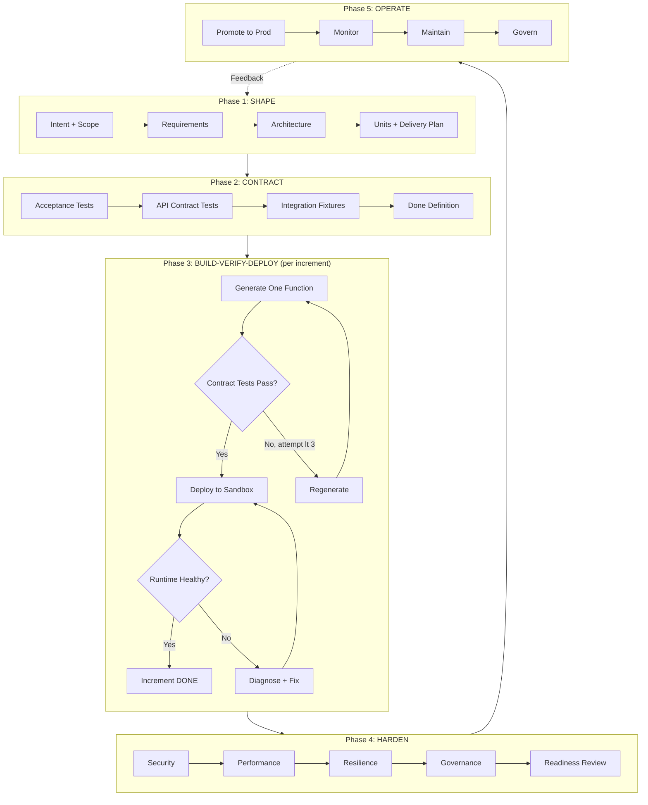

---

## 2. Trust Levels (Same Loop, Different Gates)

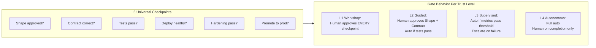

| Checkpoint | L1 | L2 | L3 | L4 |
|:---:|:---:|:---:|:---:|:---:|
| Shape | Human | Human | Auto | Auto |
| Contract | Human | Human | Auto | Auto |
| Tests pass | Human sees | Auto | Auto | Auto |
| Deploy healthy | Human clicks | Auto | Auto | Auto |
| Hardening | Human | Human | Auto if pass | Auto if pass |
| Production | Human | Human | Human | Metric-gated |

---

## 3. Phase 3 Detail: Build-Verify-Deploy Loop

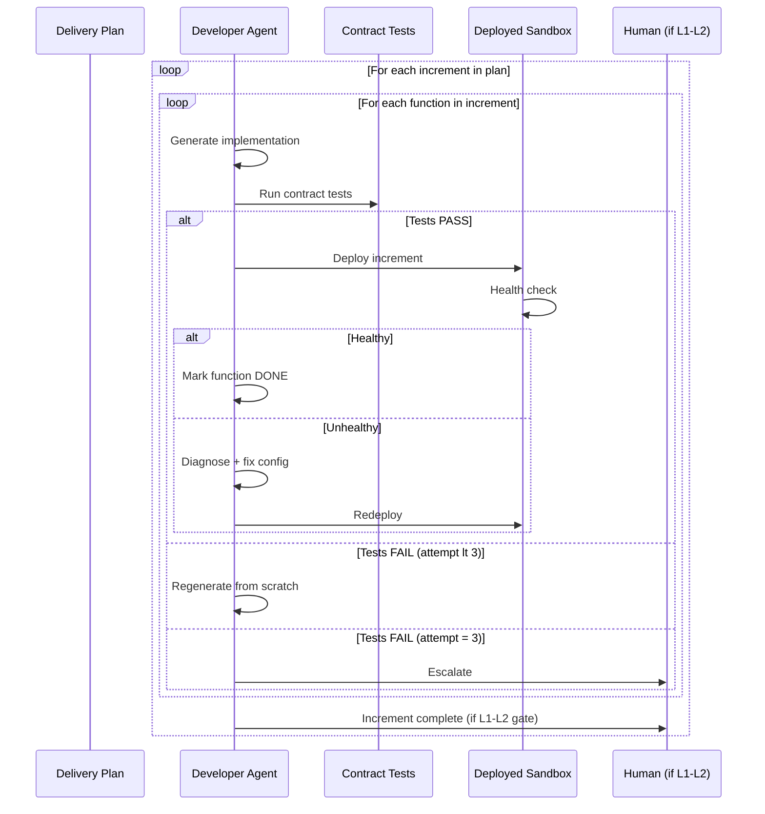

---

## 4. V2 Stage Mapping to V3 Phases

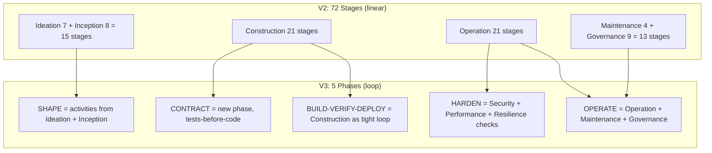

---

## 5. Execution Guarantees (Invariants)

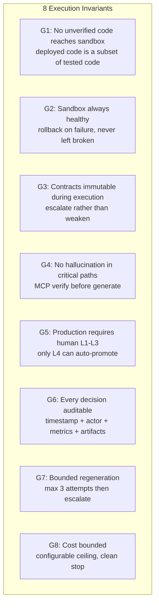

---

## 6. Quality as Continuous Policies (Not Sequential Stages)

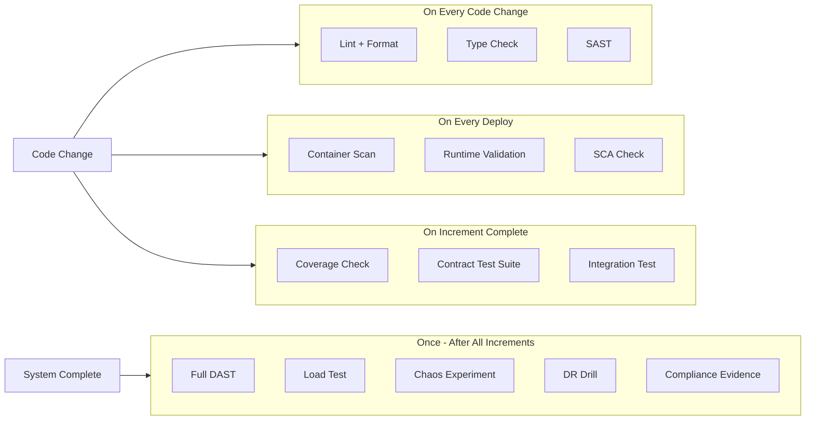

---

## 7. V2 Current: Full Stage Inventory (72 stages, 7 phases)

```mermaid
graph TD
    subgraph P0["Initialization (3)"]
        I1[workspace-scaffold]
        I2[workspace-detection]
        I3[state-init]
    end

    subgraph P1["Ideation (7)"]
        ID1B[intent-capture]
        ID2[market-research]
        ID3[feasibility]
        ID4[scope-definition]
        ID5[team-formation]
        ID6[rough-mockups]
        ID7[approval-handoff]
    end

    subgraph P2["Inception (8)"]
        IN1[reverse-engineering]
        IN2[practices-discovery]
        IN3[requirements-analysis]
        IN4[user-stories]
        IN5[refined-mockups]
        IN6[application-design]
        IN7[units-generation]
        IN8[delivery-planning]
    end

    subgraph P3["Construction (21)"]
        C1[functional-design]
        C2[nfr-requirements + nfr-design]
        C3[infrastructure-design]
        C4[code-generation]
        C5[build-and-test]
        C6[static-analysis + security-scan]
        C7[coverage + integration-verify]
        C8[frontend-verify + e2e + dast]
        C9[production-readiness-review]
        C10[data-migration + seeding]
        C11[ha-design + dr-design + cost]
        C12[ci-pipeline]
    end

    subgraph P4["Operation (21)"]
        O1[sandbox-provisioning + iac-execution]
        O2[deploy-pipeline + execution]
        O3[env-verify + runtime-validation]
        O4[runtime-fix-loop + canary]
        O5[observability + incident-response]
        O6[perf-validation + chaos + dr-validation]
        O7[drift + release + capacity-planning]
        O8[database-ops + on-call-ops]
        O9[feedback-optimization]
    end

    subgraph P5["Maintenance (4)"]
        M1[bug-triage]
        M2[dependency-update]
        M3[tech-debt-assessment]
        M4[postmortem]
    end

    subgraph P6["Governance (9)"]
        G1[dora-metrics]
        G2[compliance-evidence]
        G3[secrets-lifecycle]
        G4[data-privacy-compliance]
        G5[supply-chain-security]
        G6[access-control-review]
        G7[api-governance]
        G8[cost-governance]
        G9[change-management]
    end

    P0 --> P1 --> P2 --> P3 --> P4
    P4 -.-> P5
    P6 -.->|cross-cutting| P3
    P6 -.->|cross-cutting| P4
```

---

## 8. V3 Evolution Path (V2 to V3 in 5 Steps)

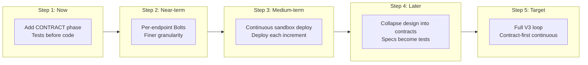

---

## 9. Workshop Experience: V2 vs V3

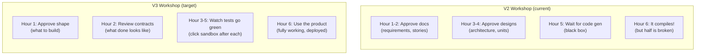

---

## 10. Metrics Comparison

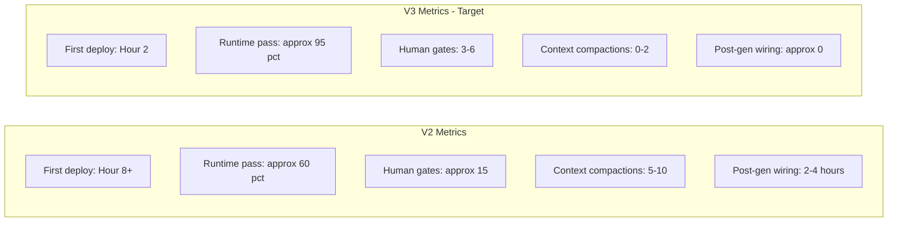

---

## 11. Multi-Agent Architecture (Unchanged V2 to V3)

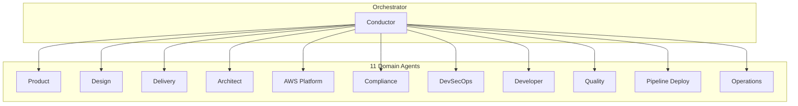

Agents are unchanged between V2 and V3. What changes is WHEN and HOW OFTEN they're invoked (V3: more frequently, finer granularity, per-function instead of per-stage).

---

## 12. Scope Grid Summary

| Scope | SHAPE | CONTRACT | BUILD Loop | HARDEN | OPERATE |
|:---:|:---:|:---:|:---:|:---:|:---:|
| Enterprise | Full (15 activities) | Full contracts | All increments | All hardening | Full ops |
| Feature | Focused (8) | Full contracts | All increments | All hardening | Full ops |
| MVP | Minimal (5) | Core contracts | All increments | Security only | Minimal ops |
| POC | Skip (1-2) | Smoke tests only | All increments | Skip | Skip |
| Bugfix | Skip | Regression test | Fix only | Security scan | Deploy |
| Workshop | Focused (8) | Full contracts | All increments | All hardening | Full ops |

---

## 13. Self-Improving Loop (Cross-Project Learning)

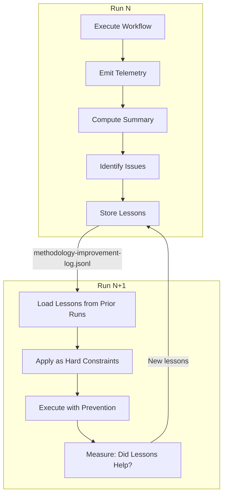

The system gets BETTER with every run. Known pitfalls become constraints. Repeated mistakes become automated prevention.

---

## 14. Adversarial Verification (Try to Break It)

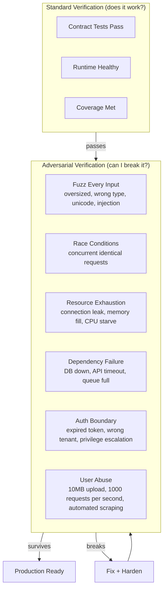

---

## 15. Three-Tier Observability Architecture

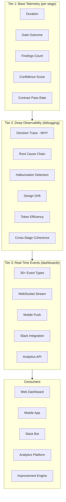

---

## 16. Complete V3 Build Loop (with all capabilities)

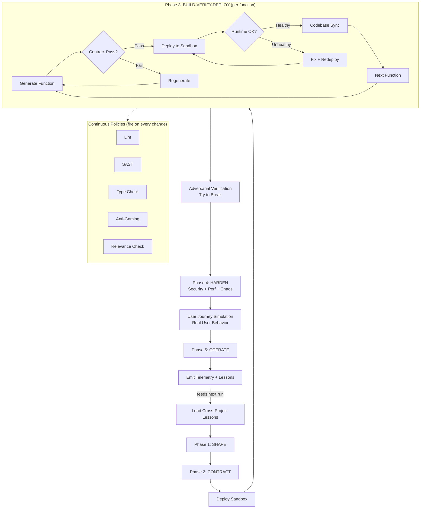

---

## 17. Final Stage Inventory (78 stages, 7 phases)

| Phase | Stages | Key Additions |
|:---:|:---:|:---|
| Initialization | 3 | Upstream (unchanged) |
| Ideation | 7 | Upstream (unchanged) |
| Inception | 8 | Upstream (unchanged) |
| Construction | 26 | +contract-gen, +sandbox-deploy, +codebase-sync, +adversarial, +static/security/coverage/integration/frontend/e2e/dast/backward/data/HA/DR/cost/production-readiness |
| Operation | 24 | +sandbox-provisioning, +iac-execution, +env-verify, +runtime-validation, +runtime-fix-loop, +canary, +chaos, +dr-validation, +drift, +release, +capacity, +database-ops, +on-call, +user-journey |
| Maintenance | 4 | bug-triage, dependency-update, tech-debt, postmortem |
| Governance | 11 | +dora, +compliance, +secrets, +privacy, +supply-chain, +access-control, +api-governance, +cost-governance, +change-mgmt, +workflow-telemetry |

**Total: 78 stages + 80 knowledge files + 3-tier observability + cross-project learning**
